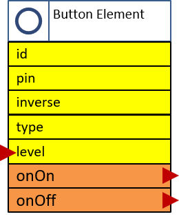

# The Button Element

The ButtonElement is used to capture button events as digital input and emit corresponding events.



The physical input level can differ from the logical input level because some buttons are pulling an input down to ground others pull them up. Also switches can be used with this Element.

## Element Configuration

The following properties are available for configuration of the element:

| Property | Description |
| ---      | --- |
| pin*     | Specifies the hardware number of the pin.
| inverse   | In normal mode a HIGH input value is reported as value 1. In inverse mode a LOW input value is reported as value 1. Normal mode is default.
| type     | The button supports different types of behaviour. See below.
| onon     | Actions.<br/>These actions are emitted when the logical level is switched to 1.
| onoff    | Actions. <br/> These actions are emitted when the logical level is switched to 0.

\* This parameter must be specified.

By using the `type` property the ButtonElement can behave differently on the input level / value.
* Specifying `LEVEL` (default) a change to input value of 1 will trigger an ON action and a change to input value of 0 will trigger an OFF action.
* Specifying `SWITCH` a change from input value of 1 to 0 will trigger alternating an ON or OFF action.

## Element State

The following properties are available with the current values at runtime

| Property | Description |
| ---      | --- |
| active   | Is set to true when the Element is active.
| value    | Current logical value of the button input.

## Example Configuration

```JSON
"button": {
  "start": {
    "pin": "14",
    "type": "TOGGLE",
    "inverse": "true",
    "onon": "device/main?log=start.",
    "onoff": " device/main?log=stop."
  }
}
```

## Example State

```JSON
"button/start": {
  "active": "true",
  "value": "1"
}
```