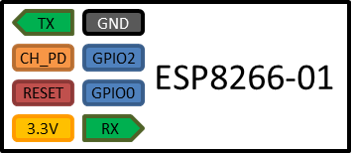
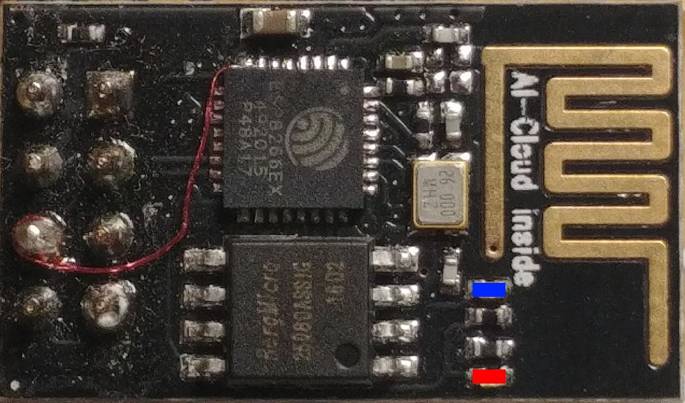

## Board ESP8266 ESP-01

The ESP­01 module contains a ESP8266 MCU and a up to 1 MByte flash memory chip.

## Overview table

| Connector | Feature                       |
| --------- | ----------------------------- |
| TX        | Serial output, programming    |
| CH_PD     | Chip Enable. 10k to VCC       |
| Reset     | Reset                         |
| 3.3V      | Power supply, needs >= 250mA. |
| GND       | reset                         |
| GPIO2     | OUTPUT, see below             |
| GPIO0     | OUTPUT, see below             |
| RX        | Serial input, programming     |
| Reset     | reset                         |

The 8 pin connector is not usable to place the chip on a solderless breadboard directly but there are adapters available.

There are multiple versions of the ESP-01 board available. In the early days also 512kByte flash memory versions have been available now most of them come with 1 MByte of flash memory. The ESP-01S has a slightly different wiring regarding the LED and a different layout of the PCB antenna ans also comes with 1MByte of flash memory.

## ESP-01 Leds

 

The first version of the ESP-01 board has 2 LEDs.

* The red LED is connected to the 3.3V Power supply and lights up constantly.
* The blue LED is connected to the Serial output pin and lights up when data is sent. When not using the TX Serial output the pin and LED can be used as a digital output too.

## ESP-01S Leds

This version of the ESP-01 board has 1 LEDs connected to the GPIOxx.

## self-made adaptor

* reset to ground
* button for  Dx? to ground starting programming
* LED on Dx
* LED on Dy
* USB to serial including a 3.3 V regulator

## Minimum adapter

The minimum 
CH_PD and RST with 10k to VCC

## GPIO 0 

This pin has to be high while booting or resetting the chip when you like to start the regular uploaded program.
After starting the program you can use it for input and output.

For example attaching a Led with resistor to ground will prohibit starting because the level of the pin is pulled to low. It is better to design all the io functionality using a high level for the inactive state and have a resistor in place to pull the default level to high.

## GPIO 1

?? You CAN control the blue LED if you do not need the TX function. TX is actually GPIO1 so by setting GPIO1 to HIGH it will light up. Ofcourse sending output to serial will spoil things.

## cheap USB adapter on eBay to run the chip

# MOD for Deep sleep

# MOD for low memory
 
 