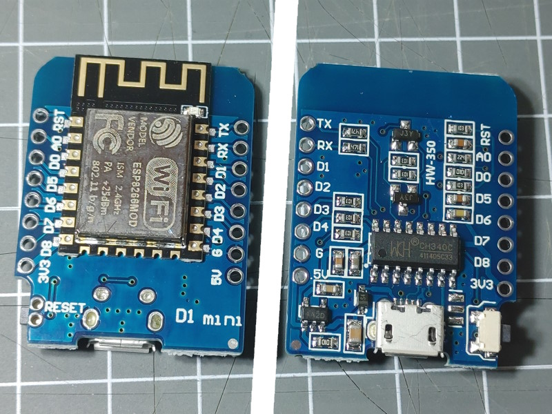

The D1 mini format foe boards and shield was created by the [wemos.cc](https://www.wemos.cc/)
company and is a good base for starting with DIY devices.

There are many different mini boards available with differend ESP processors.

They all share the position of 2 connectors with 8 pins that are compatible to a certain degree.

* 11 digital input/output pins
* 1 analog input(3.2V max input)
* 3V3, 5V, GND and RST are always in the same position
* RST momentary button

## ESP8266 based boards

### D1 mini ESP8266



The D1 mini boards use a ESP8266 MCU and 4 MByte flash memory chip.

A board configuration (env.json)

```JSON
{
  "device": {
    "0": {
      "name": "d1mini",
      "title": "D1 mini",
      "loglevel": 2,
      "description": "D1 mini board with ESP8266",
      "logfile": 1,
      "safemode": "false",
      "homepage": "/index.htm",
      "led": "D4",
      "cache": "etag"
    }
  },
  "ota": {
    "0": {
      "port": 8266,
      "passwd": "123",
      "description": "for 'over the air' OTA Updates"
    }
  },
  "ntptime": {
    "0": {
      "zone": "CET-1CEST,M3.5.0,M10.5.0/3"
    }
  }
}
```


### D1 mini V4


The D1 mini board labeld with v4 uses a ESP8266 MCU and 4 MByte flash memory chip
and includes:

* USB-C connector
* i2c connector using the Qwiic standard JST SH 4-pin (1mm)



### D1 mini pro


  The D1 mini pro board is based on the ESP8266 MCU and 4 MByte flash memory chip
  and includes:

* Built-in PCB antenna or External antenna connector
* Lithium battery interface, 500mA Max charging current with a PH 2.0 connector
* i2c connector using the Qwiic standard JST SH 4-pin (1mm)
* RST and GPIO16 can be connected using a solder spot on the back to support deep sleep mode.  



### Pins for ESP8266 boards

All the ESP8266 based boards above use the same pin assignments and are interchangeable.
The 2 connectors with 8 pins have the following ports assigned in the ESP8266.


## ESP32 based boards

There are some ESP32 based boards that use the same form factor but may not be completely compatible.


### D1 mini ESP32


A similar [D1 mini ESP32 board](/boards/esp32/d1miniesp32.md) exists
using a ESP32  MCU and 4 MByte flash memory chip.

/boards/esp32/d1miniesp32.jpg




### D1 mini ESP32 c3

<https://www.wemos.cc/en/latest/c3/index.html>

* [Board D1 Mini ESP32 C3 mini](/boards/esp32c3/d1mini-c3-mini.md)

* [Board D1 Mini ESP32 C3 pico](/boards/esp32c3/d1mini-c3-pico.md)


There are several shields available for these boards.


## Shields

There are some shields for the board forma factor available. Here some examples:


The D1 Mini 8x8 RGB Shield has 64 WS2812 LEDs that
can be addressed using the [Neo Element](/elements/light/neo.md).

The data signal for the chain of WS2812 LEDs is bound to D4.

The WS2812 leds use `"config": "rgb"`.




This is a shield you can use to create and apply special configurations by soldering
components on the free grid.




The SHT30 shield with a digital temperature and humidity sensor
can be stacked upon a board or can be attached by using a Qwiic connector cable.




The D1-Mini SD Card shield adds a sd card slot for min sd cards to the standard SPI bus.

The CS assignment can be changed on the back of the shield by cutting
the default (D4) wiring and soldering a bridge for another pin.




The SD18B20 Shield has a Dallas / DS18B20 sensor that can be used with the
[Dallas Element](../elements/dallas.md) to retrieve the local temperature.

The Data pin of the sensor is connected to D2.



The Buzzer Shield has a passive speaker that can be used with the
[Tone Element](../elements/audio/tone.md) to make some noise.

The buzzer can be connected to various pins by closing one of the solder pads.



## See also

* WeMos D1 Boards: <https://www.wemos.cc/en/latest/d1/index.html>
* WeMos Shields: <https://www.wemos.cc/en/latest/d1_mini_shield/index.html>
* <https://wolles-elektronikkiste.de/wemos-d1-mini-boards>
* <https://homeding.github.io/dev/i2c.htm>
