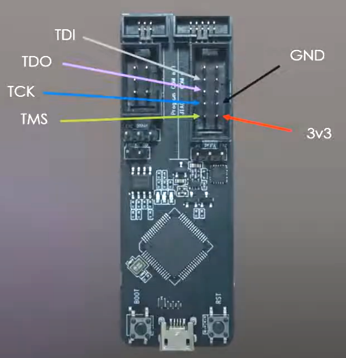
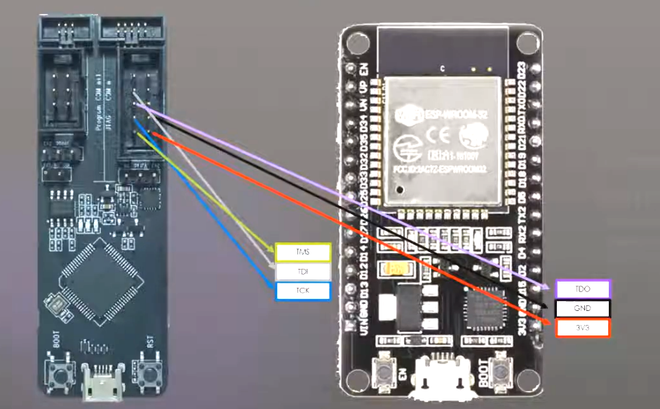

As there are many variants of the ESP32 DevKit Boards, be sure to check the used module.
Most boards use the ESP-WROOM-32 or ESP-WROOM-32D modules.

There are very similar versions available with different IO pin assignments a
USB port to Serial adapter and 3.3 V regulator.
The Reset button (EN) and the Boot button (GPIO0) is available.

Many, but not all GPIOs of the ESP32-WROOM module are available on the pins of the board.

Some have a LED on-board connected to GPIO2.

The ESP32-WROOM module features:

* 4 MByte SPI Flash memory
* 520 kByte SRAMs

## 30 pin version

## 38 pin version

<!-- See also [ESP-32-WROOM Module] -->

<!--

## ESP32 DevKitC

There is a 38-pin version of the ESP32 DevKit

-->

<!-- 
## JTAG Connections

| ESP Prog | DevKit | ESP32 JTAG Pin |
| -------- | ------ | -------------- |
| MTDO     | TDO    | GPIO15         |
| MTDI     | TDI    | GPIO12         |
| MTCK     | TCK    | GPIO13         |
| MTMS     | TMS    | GPIO14         |
| GND      | GND    | GND            |

https://www.pschatzmann.ch/home/2022/01/25/platformio-debugging-the-esp32-audiokit-os-x-and-raspberry-pi-os/

-->

## See also

* <https://circuits4you.com/2018/12/31/esp32-devkit-esp32-wroom-gpio-pinout/>
* <https://docs.platformio.org/en/latest/boards/espressif32/esp32doit-devkit-v1.html>
* <https://github.com/bdring/Grbl_Esp32/wiki/ESP32-DevKit-Versions>
* <https://randomnerdtutorials.com/getting-started-with-esp32/>

