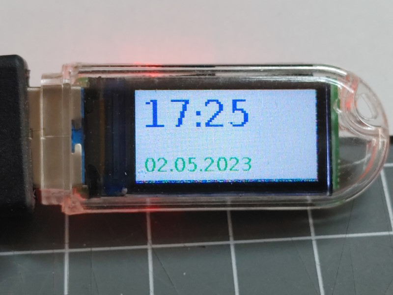
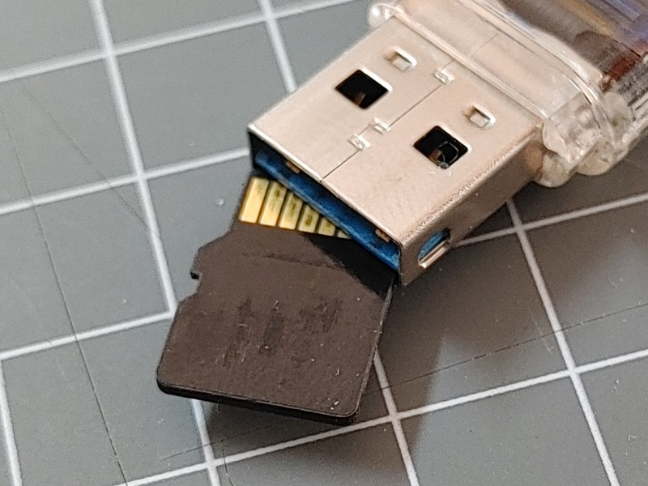

The following features are available on this board.

* ST7735 based display
* SD Card slot
* A momentary Input button
* Color LED


### ST7735 based display



The built-in display based on the ST7735 chip has a 80 * 160 resolution and is using the following pins:

| function | ESP32 pin |
| -------- | --------- |
| CS       | GPIO4     |
| MOSI     | GPIO3     |
| CLK      | GPIO5     |
| DC       | GPIO2     |
| Reset    | GPIO1     |
| LED      | GPIO38    |


### SD Card



The SD Card inside the USB connector is connected directly to the ESP32-S3 processor.
As the ESP32-S3 processor offers flexibility in using custom defined pins
a pin configuration (see below) must be given:

| function | ESP32 pin |
| -------- | --------- |
| CLK      | GPIO12    |
| CMD      | GPIO16    |
| D0       | GPIO14    |
| D1       | GPIO17    |
| D2       | GPIO21    |
| D3       | GPIO18    |


### Input Button

The input button on the back of the stick pulls the esp32-pin 0 down when pressed. 

| function | ESP32 pin |
| -------- | --------- |
| Button   | GPIO0     |

Don't configure this button in the device configuration to start the config mode as it is set to active LOW


### Color LED

APA102 LED

| function | ESP32 pin |
| -------- | --------- |
| Data     | 40        |
| Clock    | 39        |

APA102 LEDs are currently not supported by the HomeDing Library.


## Arduino Board Configuration

To compile for this board in Arduino the following settings for the board can be used:

* ESP32S3 Dev Module
* JTAG Adapter disabled
* PSRam disabled
* Flash Mode QIO 80 MHz
* Flash Size: 4MB
* USB Mode Hardware CDC and JTAG
* USB CDC On Boot: Enabled


### Diag output

``` txt
I2C pins sda=-1 scl=-1
Reset Reason: 12
 Free Heap: 310160
 Mac-address: F4:12:FA:41:38:18
Chip-Info:
  model: ESP32-S3(9)
  features: 00000012
    2.4GHz WiFi
    Bluetooth LE
  cores: 2
  revision: 0
ChipModel: ESP32-S3
Flash:
  Size: 16777216
  Mode: QIO(0)
  Speed: 80000000
```

## Board configuration

The following `env.json` configuration can be used for this board and contains settings for

* The device in general
* The ST7735 based display
* A value and pwm output to control the display brightness
* The digital input signal definition for the button on the back.


``` json
{
  "device": {
    "0": {
      "name": "dongle-s3",
      "description": "ESP32-S3 based USB stick.",
      "title": "T-Dongle-S3",
      "loglevel": 2,
      "x-button": "0",
      "led": "38"
    }
  },
  "DisplayST7735": {
    "0": {
      "description": "Display",
      "loglevel": 2,
      "width": "80",
      "height": "160",
      "rotation": 270,
      "invert": "true",
      "background": "black",
      "spiClk": 5,
      "spiMosi": 3,
      "spiDC": 2,
      "spiCS": 4,
      "resetpin": 1
    }
  },
  "digitalin": {
    "pin": {
      "pin": "0",
      "invert": "1",
      "pullup": 1
    }
  },
  "color": {
    "l": {
      "title": "Color Control",
      "config": "RGB",
      "mode": "fix",
      "loglevel": 2,
      "duration": "4s",
      "value": "xFF0000",
      "brightness": "20",
      "connect": [
        "apa102/led"
      ]
    }
  },
  "value": {
    "displayled": {
      "title": "Display Brightness",
      "min": "0",
      "max": "255",
      "value": "128",
      "onvalue": "pwmout/displayled?value=$v"
    }
  },
  "pwmout": {
    "displayled": {
      "title": "Display Backlight",
      "description": "Backlight LED dimming",
      "pin": "38",
      "range": "255",
      "invert": "1"
    }
  },
  "diag": {
    "0": {}
  },
  "apa102": {
    "led": {
      "datapin": 40,
      "clockpin": 39,
      "count": 1,
      "loglevel": 2,
      "duration": "4s",
      "xbrightness": "30",
      "xvalue": "x203050"
    }
  },
  "sdmmc": {
    "0": {
      "mmcD0": "14",
      "mmcD1": "17",
      "mmcD2": "21",
      "mmcD3": "18",
      "mmcCLK": "12",
      "mmcCMD": "16"
    }
  }
}
```


## Board test config

For first testing purpose the following configuration in `config.json` can be used:

* Dispay the current time on the display


``` json
{
  "ntptime": {
    "0": {
      "zone": "CET-1CEST,M3.5.0,M10.5.0/3"
    }
  },
  "time": {
    "clock": {
      "onminute": "displaytext/time?value=$v"
    }
  },
  "displaytext": {
    "time": {
      "x": 8,
      "y": 8,
      "fontsize": 32,
      "description": "Display the time"
    }
  }
}
```

## See also

* <https://www.lilygo.cc/products/t-dongle-s3>
* <https://github.com/Xinyuan-LilyGO/T-Dongle-S3>

