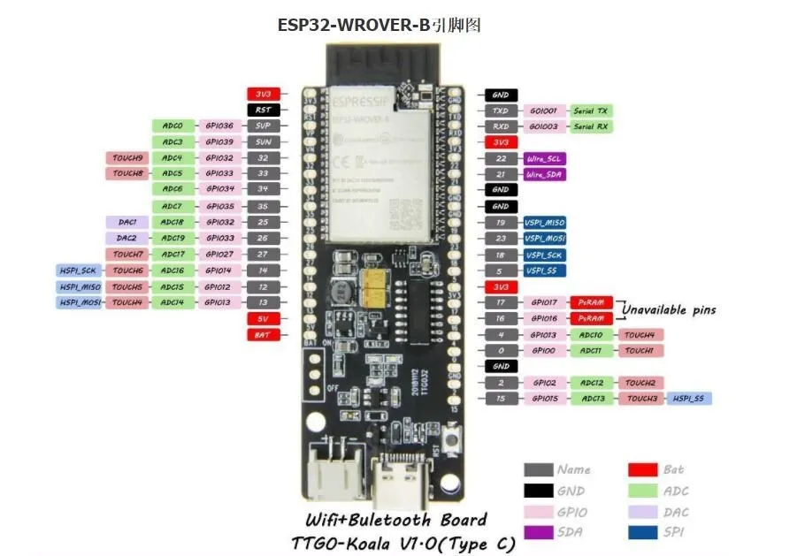

There is a version of the board available that is based on the ESP32-WROOM-32 module.
The difference is the PSRAM that is not available in the WROOM module

This board is equipped with:

* ESP	ESP32 Wrover-B module
* 3.7V battery charging circuit
* Supply voltage: 3.3V DC or 5V DC
* Flash memory: 4MByte in QIO Mode
* SRAM: 520KB
* PSRAM: 8MB, integrated in the Wrover module
* PCB dimensions: 51.4 x 25.2mm
* Momentary button for RST
* JST Connector: 2Pin 1.25mmx
* USB: Type-C connector
* USB-Bridge: CH340C chip
* LiPo Connector: JST-PH 2.0, 2 pins
* LiPo Loading Control chip TP4054
* 3 LEDS (see below)

There is a 3-pin connector to add a power switch. This allows for swithing a battery powered device on/off without
detaching the LiPo.

To use the connector the nearby 0-Ohm resistor must be desoldered.


## LEDs

There are 3 LEDs on the board.

* Red LED is Power
* Blue LED is charging indicator
* Green LED can be switched on / off by the GPIO5 pin.


* PIN 25
* PIN 35

(Noch nicht ganz sicher) *	25
Nicht nutzbar wegen PSRam	16/17


* I2C 

SDA/SCL	21/22





## LEDs

IO5 : GREEN LED

Blue LED: LiPo charge chip TP4054

RED LED: 3.3V Power

## Example env.json Device Configuration

``` json
{
  "device": {
    "0": {
      "name": "tkoala",
      "title": "T-Koala",
      "description": "LilyGO TTGO T-Koala",
      "safemode": "false",
      "homepage": "/index.htm",
      "cache": "etag"
    }
  },
  "ota": {
    "0": {}
  },
  "diag": {
    "0": {}
  },
  "digitalout": {
    "led": {
      "title": "green led",
      "description": "onboard green led",
      "loglevel": "0",
      "pin": "5",
      "value": "0"
    }
  }
}
```


```json
{
  "switch": {
    "led": {
      "onvalue": "digitalout/led?value=$v",
      "title": "switch/led"
    }
  }
}
```

## See also

* [github.com LilyGO/T-Koala](https://github.com/LilyGO/T-Koala)
* <https://de.aliexpress.com/item/1005002483438130.html>
* <https://www.fambach.net/ttgo-koala-esp32/>


