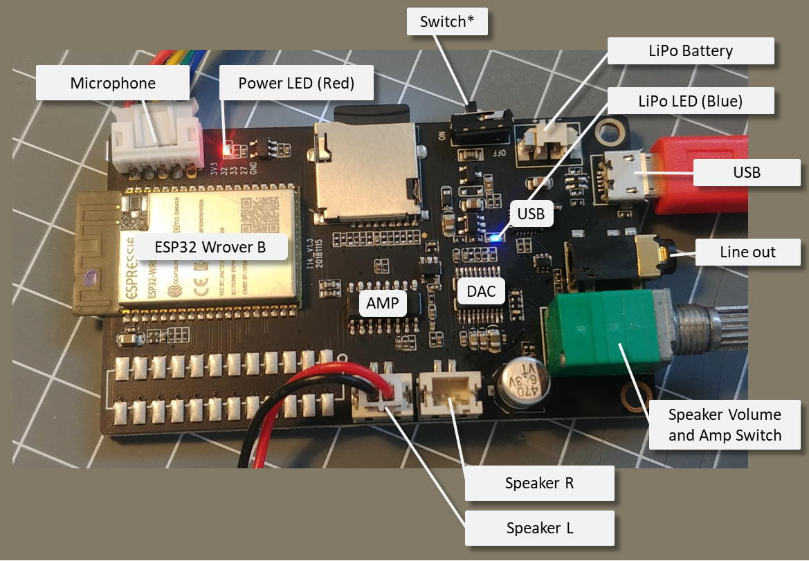

This board can be sold as a standalone board, as part of the TTGO T-Gallery kit, sometimes called TTGO-Time-Music-Box and in some documentations named T14 (v1.3).

It is built using a ESP32 Wrover-B Module, digital audio output using the I2S bus, a stereo amplifier and a colorful TFT display.

The [WebRadio example](/examples/webradio.md) is based on using this board.

{ style="width: 400px" }

{ style="width: 400px" }


## Sketch uploading

To upload a sketch the Board can be configured in Arduino using:

* **ESP32 Wroover Board (esp32)**
* Partition Scheme: 4MB with spiffs (1.2App, 1.5 SPIFFS)
* QIO
* Flash Mode 80 MHz
* (240MHz CPU Clock is enabled by default when using this board)
* (PSRAM is enabled by default when using this board)




## Pin usage overview

| ESP32 | Function     |  TFT  |  DAC  | SDMMC |  MIC  |
| ----- | ------------ | :---: | :---: | :---: | :---: |
| IO02  | SD-D0        |       |       |   X   |       |
| IO04  | SD-D1        |       |       |   X   |       |
| IO05  | TFT-CS       |   X   |       |       |       |
| IO12  | SD-D2        |       |       |   X   |       |
| IO13  | SD-D3        |       |       |   X   |       |
| IO14  | SD-CLK       |       |       |   X   |       |
| IO15  | SD-CMD       |       |       |   X   |       |
| IO18  | SCLK for TFT |   X   |       |       |       |
| IO19  | MOSI for TFT |   X   |       |       |       |
| IO21  | MUTE         |       |   X   |       |       |
| IO22  | IIS_DOUT     |       |   x   |       |       |
| IO23  | DC           |  RS   |       |       |       |
| IO25  | IIS_LRCK     |       |   x   |       |       |
| IO26  | IIS_BCK      |       |   x   |       |       |
| IO27  |              |       |       |       |   X   |
| IO32  |              |       |       |       |   X   |
| IO33  |              |       |       |       |   X   |
| RST   |              |  RST  |       |       |   X   |


## ON/OFF switch

There is a ON/OFF switch on the board that is not working as the switch is bridged by a 0-ohm resistor.
To enable using ths switch ths resistor labeled `000` next to the switch must be un-soldered.


## TFT LCD display

The 2.4 inch LCD display is of type JLX320-00202-BN. This display uses a ST7789V chip by using the SPI interface.

The background LED is powered by 3.3V VCC so brightness cannot be adjusted.

Some documentation of the TTGO-Time-Music-Box mentions a Backlight switch, but this seems to be a wrong hint.

The Homeding library supports this LCD using the [Display ST7789 Element](/elements/display/st7789.md)
based on the Adafruit_ST7789 library.

The display configuration can be found below.


## DAC chip and Mute

### Audio Path

The boards
This board has implemented an audio path for I2S Audio output that allows using the I2S interface from the ESP32 chip to create digital audio signals.
The following components are chained:

* ESP32 I2S out
* DAC PCM5102A
* Line-Out Connector
* Volume Potentiometer
* Amplifier


### DAC

The audio feature of this board include a Digital-Analog Converter (DAC) converting the I2C signal from the ESP32 wroover into an analog signal.
Here the PCM5102A chip is used.

The PCM5102A has an mute function that can be controlled via IO21. The level has to set to HIGH to disable the MUTE function.

Mute applies to the Line Out and Speaker Output.

The analog signal from the DAC is directly available at the headphone connector.
When there are no headphones plugged in the signal is forwarded to the volume regulator and amplifier on board.


### Volume control Potentiometer

Between the analog signal from the DAC to the Amplifier a 50k potentiometer levels the signal volume.
By moving beyond lowest volume the integrated switch cuts the power from the amplifier chip.


## Audio Amplifier and Mute

There is a Class-D Amplifier chip on the board that allows directly attaching stereo speakers.

Here the PAM8403 chip is used. It operates at 5V and can create 2*3W output on 4 Ohm speakers.
It offers also a mute function but this is disabled on this board.


## SD Card

The SD card on this board is actually an SDMMC Card implementation
using the **Slot 1** with 4-bit of data transfer.
This is a hardware implementation SD/MMC host controller in the ESP32
chip using the HS2_* signals in the docs (standard wiring).

| ESP32 PIN | SD Name | SD Pin |      |
| --------- | ------- | ------ | ---- |
| IO12      | Data 2  | 1      |      |
| IO13      | Data 3  | 2      |      |
| IO15      | CMD     | 3      |      |
|           | VDD     | 4      | 3.3V |
| IO14      | CLK     | 5      |      |
|           | VSS     | 6      | GND  |
| IO2       | Data 0  | 7      |      |
| IO4       | Data 1  | 8      |      |
|           |         | 9      |      |

The SDMMC interface is implemented in the ESP-IDF and you can find details at
<https://espressif-docs.readthedocs-hosted.com/projects/esp-idf/en/latest/api-reference/peripherals/sdmmc_host.html>


## Configuration

The configuration in the **env.json** file setting up all integrated hardware and common elements:

``` json
{
  "device": {
    "0": {
      "name": "webradio",
      "title": "Streaming Web Radio",
      "description": "TTGO Galery (ESP32) with color TFT display and audio",
      "loglevel": 1,
      "safemode": "false",
      "button": 0,
      "homepage": "/index.htm"
    }
  },
  "ota": {
    "0": {
      "port": 8266,
      "passwd": "123",
      "description": "Listen for 'over the air' OTA Updates"
    }
  },
  "DisplayST7789": {
    "0": {
      "loglevel": 1,
      "width": "240",
      "height": "320",
      "rotation": 90,
      "back": "black",
      "spimosi": 19,
      "spimiso": 32,
      "spiclk": 18,
      "spics": 5,
      "spidc": 23
    }
  },
  "digitalout": {
    "mute": {
      "title": "mute amp",
      "pin": 21,
      "value": 0,
      "invert": "true"
    }
  }
}
```

A simple config.env file may include fixed settings for audio processing and displaying the current title.

<!-- TODO: Another configuration can be found in the story on [building a web radio](/stories/webradio.md). -->

``` json
{
  "displaytext": {
    "station": {
      "x": 0,
      "y": 40,
      "fontsize": 16,
      "color": "white"
    },
    "info": {
      "x": 0,
      "y": 68,
      "fontsize": 12,
      "color": "white"
    }
  },
  "value": {
    "volume":  { "value": 10, "min": 0, "max": 21, "onValue": "audio/0?volume=$v" },
    "balance": { "value": 0, "min": "-16", "max": "16", "onValue": "audio/0?balance=$v" },
    "low":  { "value": 0, "min": "-40", "max": "6", "onValue": "audio/0?low=$v" },
    "mid":  { "value": 0, "min": "-40", "max": "6", "onValue": "audio/0?mid=$v" },
    "high": { "value": 0, "min": "-40", "max": "6", "onValue": "audio/0?high=$v" }
  },
  "switch": {
    "mute": {
      "value": 0,
      "onvalue": "digitalout/mute?value=$v"
    }
  },
  "audio": {
    "0": {
      "title": "audio processing",
      "bclk": 26,
      "lrc": 25,
      "dout": 22,
      "url": "audio/0?url=https://dispatcher.rndfnk.com/hr/hr3/live/mp3/high",
      "ontitle": "displaytext/info?value=$v",
      "onstation": "displaytext/station?value=$v"
    }
  }
}
```

## Microphone

(not tested)

<!--

Type ICS-43434

(434 QJ29Y)
(4j434 ICS-43434)

    GPIO Pins --- Mic 
    27        --- data  
    32        --- BCK
    33        --- LRCK 
    +3v3      --- VCC
    GND       --- GND

<https://github.com/LilyGO/TTGO-T5S-Epaper/blob/master/ESP32_MEMSMic/ESP32_MEMSMic.ino>
<https://github.com/elshnkhll/ICS43434>

-->

### Diverse other chips

* CP2104: USB-to-UART Bridge Controller
* ME6211: 3.3 regulator
* TP4054: Battery charger
* Blue LED when charging
* SM_20PIN connector is not populated with a connector but documented in the schematic


## See also

* Official Product Page: <http://www.lilygo.cn/prod_view.aspx?TypeId=50033&Id=1168>
* Kit Assembly video: <https://www.youtube.com/watch?v=yfz6r5khsMk>
* TTGO-Time-Music-Box <https://github.com/LilyGO/TTGO-Time-Music-Box> (including the schematic)
* <https://github.com/lewisxhe/TTGO-Time-Music-Box>
* <https://github.com/Xinyuan-LilyGO/Ka-Radio32?spm=a2g0o.detail.1000023.2.41542f1andLoEs>
* <https://learn.sparkfun.com/tutorials/i2s-audio-breakout-hookup-guide/all>
* <https://github.com/LilyGO/TTGO_T_Gallery> Incomplete Kit Documentation (only pictures)
* Active GitHub: <https://github.com/Xinyuan-LilyGo>

* PCM5102a DAC datasheet <http://www.ti.com/lit/ds/symlink/pcm5102a.pdf>
* PAM8403 datasheet <https://www.diodes.com/assets/Datasheets/PAM8403.pdf>
