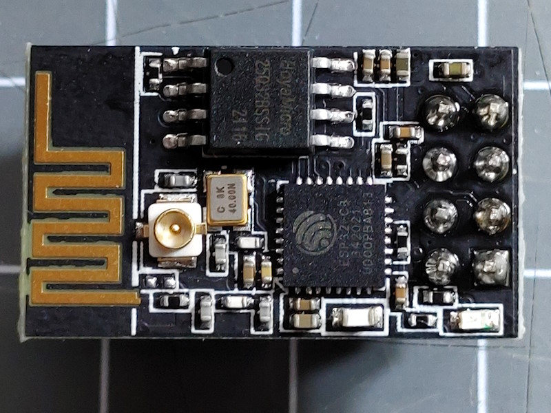

The ESP01 form factor was initially used for the ESP8266 processor on the [Board ESP8266 ESP-01](/boards/esp8266/esp01.md).
The original version has limited Flash memory (512kByte).

As of it's popularity there are variants using the ESP8266 and ESP8285 (= ESP8266 + 1M Flash in the same chip)
and more flash memory.

This board can be used with the [Standard Example](/examples/standard.md) and [DevDing Example](/examples/devding.md)
using the following settings:

* DIO
* 4MByte Flash
* GPIO3 on board LED
* IPEX external antenna connector

## See also

* [About using the ESP32 with HomeDing](/boards/esp32/readme.md)
* [ESP32-C3 Boards](/boards/esp32c3/index.md)
