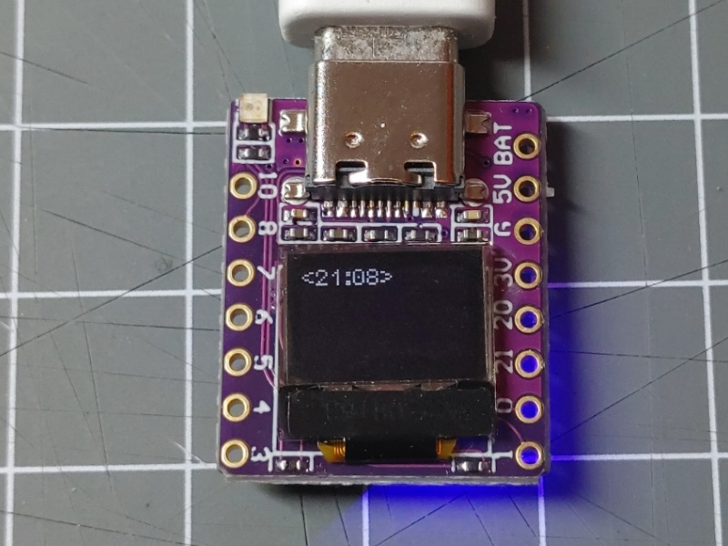

This board is not supported by Adafruit library. Some small modifications must be made that can be found in
<https://github.com/mathertel/Adafruit_SSD1306>.

This board comes with

* 4MB Flash
* Ceramic WiFi Antenna
* One Neo Pixel/WS2812 LED.
* QWIIC compatible socket for wiring I2c based sensors.
* OLED display based on SSD1306 chip attached through I2C Interface.
* USB-C connector, directly connected to ESP32-C3 processor.
* 5V to 3.3V regulator on board.


## WS2812 RGB LED

* This LED is attached to the pin GPIO 2 and can be controlled by using a [Neo Element](/elements/light/neo.md).

``` json
{
  "neo": {
    "bar": {
      "pin": "2",
      "value": "red",
      "count": 1
    }
  }
}
```


## System configuration

This **env.json** file can be used as a starting point for configuring this board type.

It contains the onboard special hardware initialization for the IO09 button, the OLED display and the
neopixel.

``` json
{
  "device": {
    "0": {
      "name": "microc3",
      "description": "micro esp32c3 with OLED display and Neopixel.",
      "loglevel": "2",
      "button": "9",
      "logfile": 2,
      "safemode": "false",
      "homepage": "/board.htm",
      "cache": "max-age=600",
      "i2c-SDA": "5",
      "i2c-SCL": "6"
    }
  },
  "ota": {
    "0": { }
  },
  "ntptime": {
    "0": {
      "zone": "CET-1CEST,M3.5.0,M10.5.0/3"
    }
  },
  "DisplaySSD1306": {
    "0": {
      "address": "60",
      "brightness": "128",
      "width": 72,
      "height": 40,
      "rotation": 0
    }
  },
  "neo": {
    "bar": {
      "pin": "2",
      "value": "red",
      "count": 1
    }
  }
}
```


## Device configuration

The **config.json** file will contain the functionality of the device. This is a minimal configuration that

* displays the current time
* and a digitalin element to support the :

``` json
{
  "displaytext": {
    "time": {
      "x": 0,
      "y": 0,
      "value": "21:08",
      "fontsize": 24
    }
  },
  "value" : {
    "bright": {
      "min": 0,
      "max": 100,
      "value": 8,
      "onvalue": "DisplaySSD1306/0?brightness=$v"
    }
  },

  "time": {
    "clock": {
      "onminute": "displaytext/time?value=$v"
    }
  },
  "digitalin": {
    "9": {
      "pin": 9,
      "pullup": "true"
    }
  }
}
```


## See Also

* [ESP32-C3 Boards](/boards/esp32c3/index.md)
* <https://github.com/01Space/ESP32-C3-0.42LCD>


# define LED_PIN 2 : WS2812B


<!-- 

## Debugging

Flashing ESP32-C3 using built-in usb serial/jtag controller
<https://esp32.com/viewtopic.php?f=2&t=24419>

<https://code.visualstudio.com/docs/cpp/launch-json-reference>

<https://docs.espressif.com/projects/esp-idf/en/v4.3/esp32c3/api-guides/jtag-debugging/index.html?highlight=debug>

<https://www.wemos.cc/en/latest/c3/c3_mini.html>


{
  // Use IntelliSense to learn about possible attributes.
  // Hover to view descriptions of existing attributes.
  // For more information, visit: <https://go.microsoft.com/fwlink/?linkid=830387>
  "version": "0.2.0",
  "configurations": [
      {
    "name": "ESP-Prog Debug",
    "type": "gdb",
    "request": "launch",
    "target": "./build/HelloWorld.ino.elf",
    "cwd": "${workspaceFolder}",
    "gdbpath": "${config:esp_gdb}",
    "preLaunchTask": "OpenOCD",
    "autorun": [
      "target remote :3333",
      "mon reset halt",
      "flushregs",
      "thb app_main",
      "c"
    ],
  }
  ]
}


Display in separate shop <https://www.smart-prototyping.com/0_42-inch-OLED-Bare-Display-72-40-SSD1306>

DataSheet: <https://www.smart-prototyping.com/image/data/2020//12/102123%20%200.42%20inch%20OLED%20Bare%20Display%20(72x40,%20SSD1306)/0.42-ZJY042-7240TSWEG01.pdf> -->

