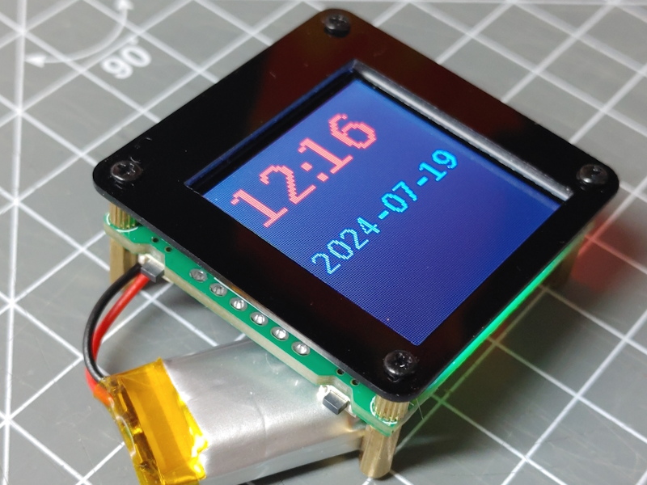

The Spotpear ESP32C3 board with 1.44 inch LCD display is a very compact version of a LCD + ESP32C3 combination.

<!--  -->

## Features

* ST7735 128*128 display on SPI bus
* 3 custom buttons
* reset button
* LED
* LiPo charger
* USB bust directly connected to ESP32C3


DC   = GPIO0
CS   = GPIO2
SCK  = GPIO3
MOSI = GPIO4
RST  = GPIO5

key1 = IO8
Key2 = IO10
Boot = IO9
Reset = Chip_EN

LED: IO11 (HIGH = ON)

BAT : PL4054

## System configuration

This **env.json** file can be used as a starting point for configuring this board type and includes all on-board hardware definitions:

```json
{
  "device": {
    "0": {
      "name": "spotpearc3",
      "title": "Spotpear 1.44 LCD",
      "description": "Spotpear ESP32C3 board with 1.44 inch LCD display",
      "loglevel": "2",
      "logFile": "1",
      "xi2c-scl": "5",
      "xci2c-sda": "4"
    }
  },
  "ota": {
    "0": {}
  },
  "ntptime": {
    "0": {
      "zone": "CET-1CEST,M3.5.0,M10.5.0/3"
    }
  },
  
  "DisplayST7735": {
    "0": {
      "description": "Display",
      "loglevel": 2,
      "width": "128",
      "height": "128",
      "colOffset": 0,
      "rowOffset": 0,

      "busmode": "spi",
      "spiClk": 3,
      "spiMosi": 4,
      "resetPin": 5,
      "spiDC": 0,
      "spiCS": 2,
      "rotation": 0
    }
  },
  
  "state": {
    "0": { "savedelay": "8s" }
  },

  "digitalout": {
    "led": {
      "pin": "11",
      "invert": "false"
    }
  },

  "digitalin": {
    "boot": {
      "title": "Boot button signal",
      "pin": "9",
      "invert": "true"
    },
    "key1": {
      "title": "Key 1",
      "pin": "8",
      "invert": "true"
    },
    "key2": {
      "title": "Key 2",
      "pin": "10",
      "invert": "true"
    },
  }
}
```


"C:\Users\Matthias\AppData\Local\Arduino15\packages\esp32\tools\esptool_py\4.5.1/esptool.exe" --chip esp32s3 --port "COM7" --baud 921600  --before default_reset --after hard_reset write_flash  -z --flash_mode dio --flash_freq 80m --flash_size 16MB 0x0 "C:\Users\Matthias\AppData\Local\Temp\arduino\sketches\4674C825DA1B04228EA2E0E8F53E9C1D/BigDisplay.ino.bootloader.bin" 0x8000 "C:\Users\Matthias\AppData\Local\Temp\arduino\sketches\4674C825DA1B04228EA2E0E8F53E9C1D/BigDisplay.ino.partitions.bin" 0xe000 "C:\Users\Matthias\AppData\Local\Arduino15\packages\esp32\hardware\esp32\2.0.17/tools/partitions/boot_app0.bin" 0x10000 "C:\Users\Matthias\AppData\Local\Temp\arduino\sketches\4674C825DA1B04228EA2E0E8F53E9C1D/BigDisplay.ino.bin"


    "board": "esp32:esp32:esp32c3",
    "configuration": "JTAGAdapter=default,CDCOnBoot=cdc,PartitionScheme=default,CPUFreq=160,FlashMode=qio,FlashFreq=80,FlashSize=4M,UploadSpeed=921600,DebugLevel=none,EraseFlash=all",


## See also

* [ESP32-C3 1.44 LCD at spotpear](https://spotpear.com/index/product/detail/id/1354.html)
* [ESP32-C3 1.44 LCD User Guide @ spotspear](https://spotpear.com/index/study/detail/id/1121.html)
* [GitHub Project](https://github.com/Spotpear/ESP32C3_1.44inch)
