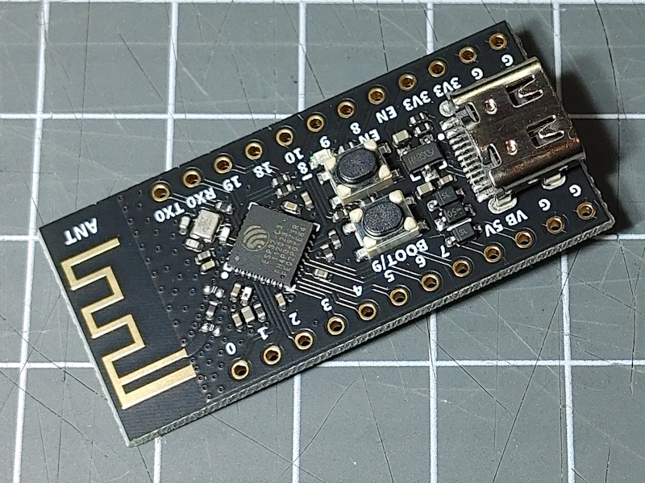

The [ESP32-C3 processor](index.md) is a single-core SoC based on the open-source 32-bit RISC-V architecture.



## Arduino Board Configuration

The Arduino Board Manager supports this board by installing the `esp32 by espressif` package.  It can be used with the
following settings:

* Board: **ESP32C3 Dev Module**
* Upload Speed: 921600
* USB CDC On Boot: Enabled
* CPU Frequency: 160 MHz
* Flash Frequency: 80MHz
* Flash Mode: QIO
* Flash Size: 4MByte (32Mbit)
* Partition Scheme: Default 4MB with spiffs (1.2MB App/1.5MB SPIFFS)
* Core Debug Level: None
* Erase All Flash: Disabled
* JTAG Adapter: Integrated USB JTAG


## Feature X

## Device

## Display

## Display Touch (CST816D) Controller

## Battery Management

## System configuration

This **env.json** file can be used as a starting point for configuring this board type.

```json
```

## See Also

* [Boards overview](/boards/index.md)
* [ESP32-C3 Boards](/boards/esp32c3/index.md)
* <https://www.espressif.com/sites/default/files/documentation/esp32-c3-mini-1_datasheet_en.pdf>
