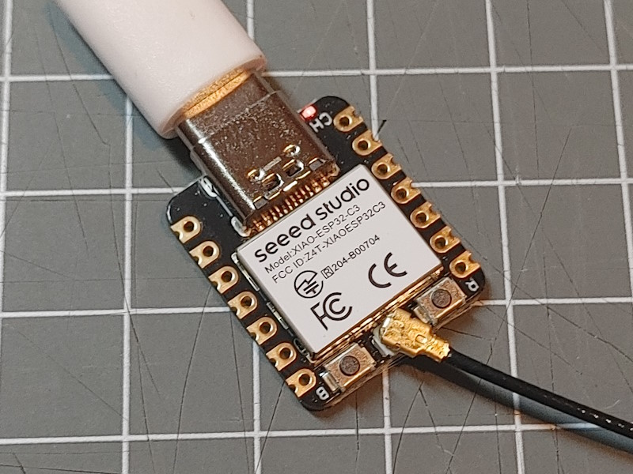

# XIAO ESP32 C3

The XIAO ESP32C3 board using the ESP32-C3 processor is a very small board that can easily be
flashed and comes with a connector for an external antenna.



The ESP32-C3 processor has a 32-bit single core RISC-V cpu running at max. 160MHz and
400KB SRAM memory. Bluetooth LE is supported.

As there are no additional power consuming components on this board is fits good for
un-powered/battery based use cases. It has a onboard lithium battery charging chip to recharge
using the USB-C connector.

* $5 low price
* An external antenna must be connected. There is no antenna on board but a I-PEX connector.
* On board LiPo battery charger chip for a battery connected at the bottom side with solder pads.
* Very small size
* The OnBoard LED is a charging indicator


## Arduino Board configuration

The ESP32 board Manager in the Arduino environment has a dedicated board type
`XIAO_ESP32C3 (esp32)` that fits to this board.

* Flash Mode is QIO
* Flash Size 4MByte (32Mbit)

## System configuration

This **env.json** file can be used as a starting point for configuring this board type:

```json
{
  "device": {
    "0": {
      "name": "xiaoc3",
      "title": "XIAO ESP32C3",
      "description": "XIAO_ESP32C3 board",
      "loglevel": "2",
      "logFile": "1",
      "xi2c-scl": "5",
      "xci2c-sda": "4"
    }
  },
  "ota": {
    "0": {}
  },
  "ntptime": {
    "0": {
      "zone": "CET-1CEST,M3.5.0,M10.5.0/3"
    }
  },
  "state": {
    "0": { "savedelay": "8s" }
  },
  "digitalin": {
    "boot": {
      "title": "Boot button signal",
      "pin": "9",
      "invert": "true"
    }
  }
}
```


### config.json

```json
{
  "value": {
    "sw": {
      "title": "Stateful Value",
      "min": "0",
      "max": "100",
      "useState": "true"
    }
  }
}
```


## See Also

* Manufacurer and Shop: <https://www.seeedstudio.com/Seeed-XIAO-ESP32C3-p-5431.html>
* <https://wiki.seeedstudio.com/XIAO_ESP32C3_Getting_Started/>
* <https://sigmdel.ca/michel/ha/xiao/xiao_esp32c3_intro_en.html>

