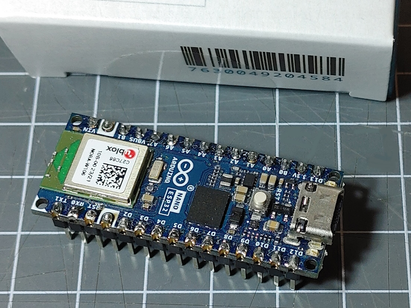

This board can be bought from the Arduino Store. <https://store.arduino.cc/products/nano-esp32>

NORA-W106-10B: <https://www.u-blox.com/en/product/nora-w10-series>
DataSheet: <https://content.u-blox.com/sites/default/files/documents/NORA-W10_DataSheet_UBX-21036702.pdf>

MCU: Xtensa LX7, 240 MHz dual-core
RAM: 512 kByte
PSRAM 8192 kByte
Flash: 16 MByte

## Arduino Board Configuration

To compile for this board in Arduino the following settings for the board can be used:

* ESP32S3 Dev Module
* JTAG Adapter disabled
* PSRam disabled
* Flash Mode QIO 80 MHz
* Flash Size: 4MB
* USB Mode Hardware CDC and JTAG
* USB CDC On Boot: Enabled

## See Also

* Arduino Getting Started with Nano ESP32: <https://docs.arduino.cc/tutorials/nano-esp32/getting-started-nano-esp32>
* Cheat Sheet: <https://docs.arduino.cc/tutorials/nano-esp32/cheat-sheet>
* Data sheet <https://docs.arduino.cc/static/b8af299e4c00e7220396e2c4c528c12a/ABX00083-datasheet.pdf>
* Full pin diagram: <https://docs.arduino.cc/static/f712042dfc42b75d6745293a60d6cd4a/ABX00083-full-pinout.pdf>
* Full pin schematics: <https://docs.arduino.cc/static/ba720d742e9db4f65d217a422f155695/ABX00083-schematics.pdf>

static const int8_t TO_GPIO_NUMBER[NUM_DIGITAL_PINS] = {
    [D0]        = 44, // RX
    [D1]        = 43, // TX
    [D2]        = 5,
    [D3]        = 6,  // CTS
    [D4]        = 7,  // DSR
    [D5]        = 8,
    [D6]        = 9,
    [D7]        = 10,
    [D8]        = 17,
    [D9]        = 18,
    [D10]       = 21, // SS
    [D11]       = 38, // MOSI
    [D12]       = 47, // MISO
    [D13]       = 48, // SCK, LED_BUILTIN
    [LED_RED]   = 46,
    [LED_GREEN] = 0,
    [LED_BLUE]  = 45, // RTS
    [A0]        = 1,  // DTR
    [A1]        = 2,
    [A2]        = 3,
    [A3]        = 4,
    [A4]        = 11, // SDA
    [A5]        = 12, // SCL
    [A6]        = 13,
    [A7]        = 14,
};
