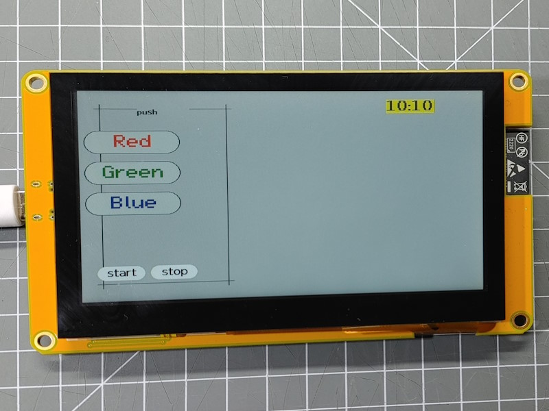
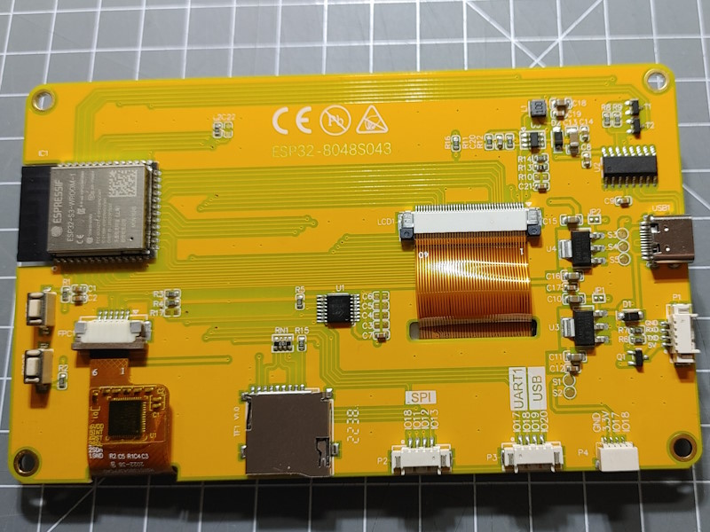

There are some boards with displays and touchscreens available that combine display.





This board is equipped with:

* ESP32-S3 processor
* 16 MByte Flash in QIO mode
* 8 MByte PSRAM OPI
* 4.3 inch, 800 * 480 px Display based on ST7262: 16 bit color, special ESP32-S3 parallel mode
  The display is supported by the "GFX Library for Arduino".
* Touch Sensor: GT911 on I2C, Address 0x5D
* I2C bus using SDA=19, CLK=20
* SD Card slot

## Arduino Configuration

The ESP32S3 Dev Module (esp32) can be used with the following settings:

* JTAG Adapter: Disbled
* PSRAM: OPI PSRAM
* Flash Mode: QIO 80MHz
* Flash Size: 16MByte (128Mbit)
* Arduino Runs On: Core 1
* Events Runs On: Core 1
* USB Mode: Hardware CDC amd JTAG
* USB CDC On Boot: Disabled
* USB Firmware MSC on Boot: Disabled
* Upload Mode: UAT0 / Hardware CDC
* Partition Scheme: ___
* CPU Frequency: 240MHz
* Upload Speed: 921600
* Core Debug Level: None
* Erase All Flash: Disabled


The one used here is labeled **ESP32-8048S043C** from <http://www.jczn1688.com> and available
on AliExpress. On the web site you find documentation but be they seem not to fit to the current boards. Some testing was required.

These type of boards are available in various versions with different displays and touchscreen
drivers and this example may be adapted to other configurations when required.

The **ESP32-8048S043C** has the following components:

Download of files is available at <http://www.jczn1688.com/zlxz>, Download passwort: jczn1688


<!-- <https://github.com/PaulStoffregen/XPT2046_Touchscreen> -->

## env.json configuration

```json
{
  "device": {
    "0": {
      "name": "panel",
      "title": "Panel 800*480",
      "description": "Panel with 800 px",
      "loglevel": "2",
      "logfile": 2,
      "safemode": "false",
      "homepage": "/board.htm",
      "cache": "etag",
      "i2c-SDA": "19",
      "i2c-SCL": "20"
    }
  },
  "ota": {
    "0": {}
  },
  "ntptime": {
    "on": {
      "zone": "CET-1CEST,M3.5.0,M10.5.0/3"
    }
  },

  "DisplayEsp32panel": {
    "0": {
      "width": "800",
      "height": "480",
      "color": "x000000",
      "background": "xbbbbbb",
      "lightpin": 2
    }
  },

  "DisplayTouchGT911": {
    "0": {
      "address": "0x5D",
      "width": "1200",
      "height": "880",
      "rotation": "0",
      "interruptpin": "-1",
      "resetpin": "38"
    }
  },

  "sd": {
    "0": {
      "cspin": "10"
    }
  },

  "digitalin": {
    "gpio0": {
      "pin": "0",
      "invert": "1"
    }
  }

}
```


## Boot Button

The Boot button is connected to GPIO0 and is used to start the ESP32 into the sketch download mode.
Pressing this button will pull the GPIO0 low.

You can use this as a general purpose input button.


## Display

The IPS LCD display is supporting a resolution of 800x480 pixels and is based on the ST7262 chip.  

It is connected to the processor using 4 control signals and 16 data signals and is designed to
use DMA to transfer the display data from RAM to the display.

It supports a 16 bit color depth: 5 bits red, 6 bits green, 5 bits blue

The display setup using the "GFX Library for Arduino" is:

```cpp
Arduino_ESP32RGBPanel *rgbpanel = new Arduino_ESP32RGBPanel(
    40 /* DE */, 41 /* VSYNC */, 39 /* HSYNC */, 42 /* PCLK */,
    45 /* R0 */, 48 /* R1 */, 47 /* R2 */, 21 /* R3 */, 14 /* R4 */,
    5 /* G0 */, 6 /* G1 */, 7 /* G2 */, 15 /* G3 */, 16 /* G4 */, 4 /* G5 */,
    8 /* B0 */, 3 /* B1 */, 46 /* B2 */, 9 /* B3 */, 1 /* B4 */,

    0 /* hsync_polarity */, 8 /* hsync_front_porch */, 4 /* hsync_pulse_width */, 8 /* hsync_back_porch */,
    0 /* vsync_polarity */, 8 /* vsync_front_porch */, 4 /* vsync_pulse_width */, 8 /* vsync_back_porch */
);
```

The RAM for the display image is allocated in the PSRAM using 800*400*2 bytes = 640.000 bytes = **625 kBytes**.


### Backlight control

The display uses a backlight that can be controlled on through GPIO02.


## Touch panel

The touch panel is a capacitive type based on the GT911 chip.

There is a variant of this board available using a resistive touch sensor.

The communication to the GT911 chip is using the i2c bus on address 0x5d.


## SD Card

The SD card is available at the standard SPI bus of ESP32. The
[SD Card Element](/elements/sd.md) can be used to extend the filesystem
and to mount the sd card file system on the `/sd` folder.

| function | ESP32 pin |
| -------- | --------- |
| CS       | GPIO10    |
| SPI-bus  | VSPI      |


## See also

* ESP32-S3 DMA (EDMA) with PSRAM and LCD  <https://esp32.com/viewtopic.php?t=24096>
* <http://www.jczn1688.com>
* <https://wiki.makerfabs.com/Sunton_ESP32_S3_4.3_inch_800x400_IPS_with_Touch.html>
* <https://www.makerfabs.com/sunton-esp32-s3-4-3-inch-ips-with-touch.html>
