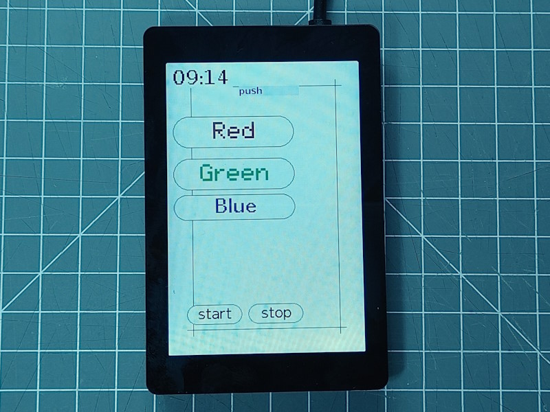

This board is equipped with:

* 3.5 inch, 320 * 480 px Display based on ST7796UI supporting 16 bit color 8-bit parallel interface
  The display is supported by the "GFX Library for Arduino".
* Touch Sensor: FT6336U on I2C, Address 0x38
* ESP32-S3 processor
* 16 MByte Flash in QIO mode
* 2 MByte PSRAM (OPI)
* I2C bus using SDA=6, CLK=5
* USB-C connector connected to the processor
* SD Card slot

There are connectors on the board supporting RS485, Speaker and GPIO.

The Board is manufacured by Smart Panlee with id ZX3D50CE08S-USRC-4832.


## LCD Display

The ST7796UI based Display can be used by configuring the [DisplayST7796 Element](/elements/display/st7796.md).

The configuration is provided below.


## Display Touch

The Touch controller FT6336U is used in this panel and can be used by configuring the
[DisplayTouchFT6336 Element](/elements/display/touchft6336.md).

This FT6x36 variant supports up to 2 touch points.

The configuration is provided below.


## SD Card

[4] SD Card Interface (Tab.4)
Description Module Pin Remark
SD_CS GPIO 41 SD card chip selection
SD_DI（MOSI） GPIO 40 SD card data input
SD_CLK GPIO 39 SD card clock
SD_DO（MISO） GPIO 38 SD card data


## Configuration

The configuration in the **env.json** file setting up all integrated hardware and common elements:

``` json
{
  "device": {
    "0": {
      "name": "sc01panel",
      "title": "SC01-Panel",
      "description": "SC01 Plus Panel",
      "loglevel": "2",
      "logfile": 1,
      "safemode": "false",
      "homepage": "/board.htm",
      "xcache": "etag",
      "i2c-SDA": "6",
      "i2c-SCL": "5",
      "spi-scl": "39",
      "spi-miso": "38",
      "spi-mosi": "40"
    }
  },
  "ota": {
    "0": {}
  },
  "DisplayST7796": {
    "0": {
      "busmode": "lcd8",
      "ips": 1,
      "width": "320",
      "height": "480",
      "resetpin": 4,
      "lightpin": 45,

      "color": "black",
      "border": "black",
      "background": "#cccccc"
    }
  },
  "DisplayTouchFT6336": {
    "0": {
      "width": "320",
      "height": "480",
      "rotation": "0"
    }
  },
  "sd": {
     "0": { "title": "SD Card", "cspin": "41" }
   }
}
```


## See also

* <http://en.wireless-tag.com/>
* <http://en.wireless-tag.com/product-item-26.html>
* <https://img01.71360.com/file/read/www2/M00/4E/C6/rBwBEmRl7OaAW78bABKfZLYNMv4194.pdf?dl=1&dlf=WT32-SC01+PLUS+Datasheet-V1.5+EN.pdf>

* <https://99tech.com.au/product/lcd-wt32-sc01-plus>
* <https://99tech.com.au/mx-m/lcd/lcd-wt32-sc01-plus_datasheet.pdf>
