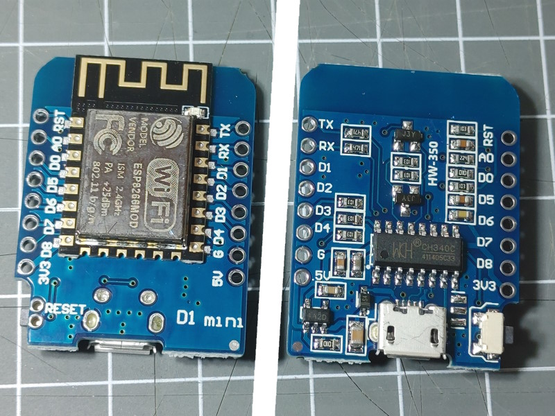



### D1 mini ESP8266



The D1 mini board uses a ESP8266 MCU and 4 MByte flash memory chip.

A board configuration (env.json)

```JSON
{
  "device": {
    "0": {
      "name": "d1mini",
      "title": "D1 mini",
      "loglevel": 2,
      "description": "D1 mini board with ESP8266",
      "logfile": 1,
      "safemode": "false",
      "homepage": "/index.htm",
      "led": "D4",
      "cache": "etag"
    }
  },
  "ota": {
    "0": { }
  },
  "ntptime": {
    "0": {
      "zone": "CET-1CEST,M3.5.0,M10.5.0/3"
    }
  }
}
```


### D1 mini ESP32-C3

{{ imgCard(collections.all, item = '/boards/esp32c3/mini') }}

{{ imgCard(collections.all, item = '/boards/esp32c3/pico') }}


## See also

* WeMos D1 Boards: <https://www.wemos.cc/en/latest/d1/index.html>
* WeMos Shields: <https://www.wemos.cc/en/latest/d1_mini_shield/index.html>
* <https://wolles-elektronikkiste.de/wemos-d1-mini-boards>
* <https://homeding.github.io/dev/i2c.htm>
