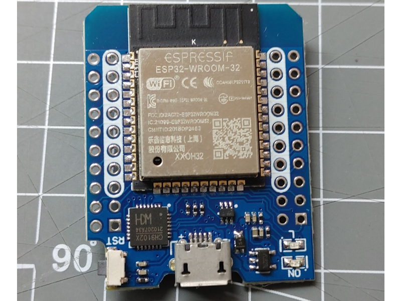
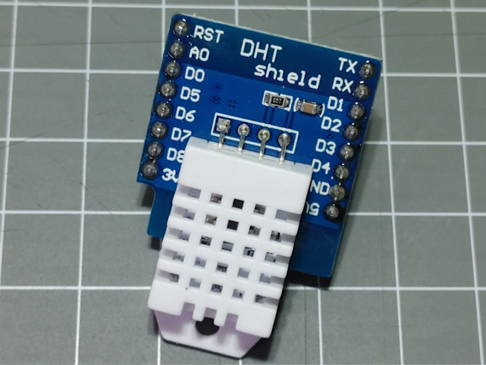
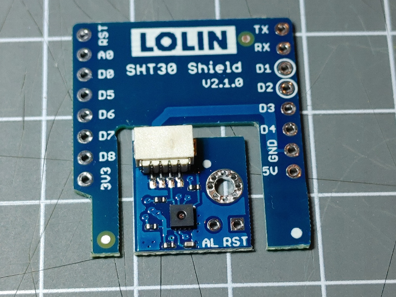
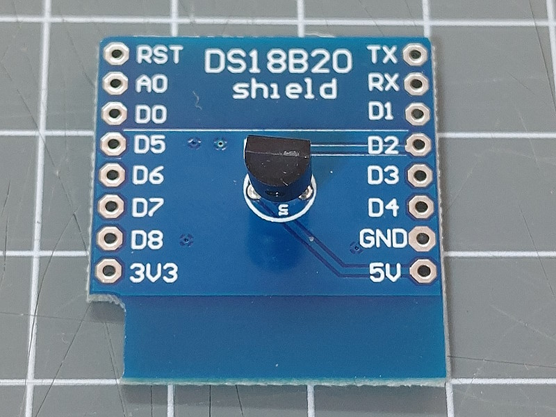
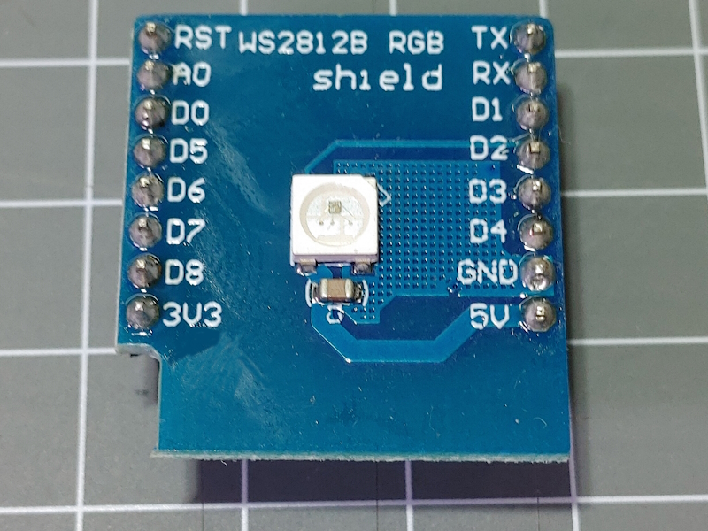
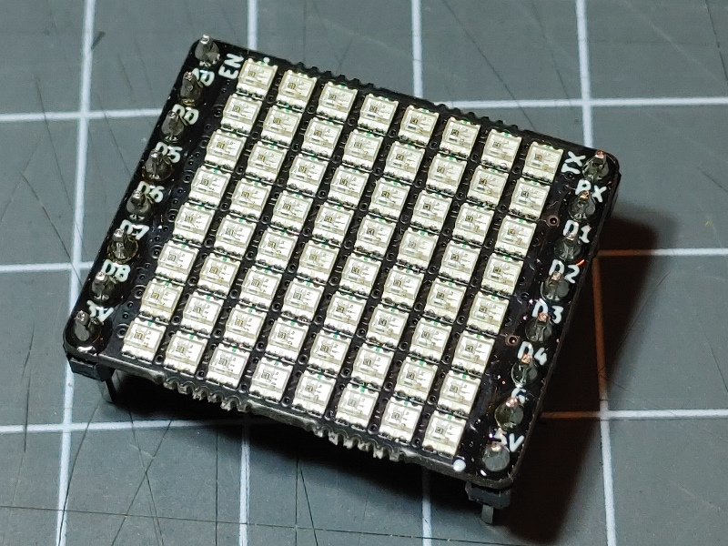
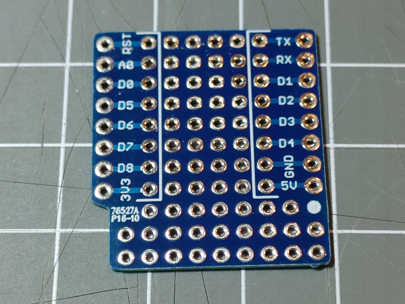
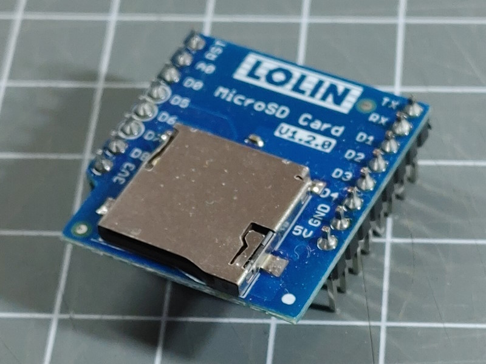
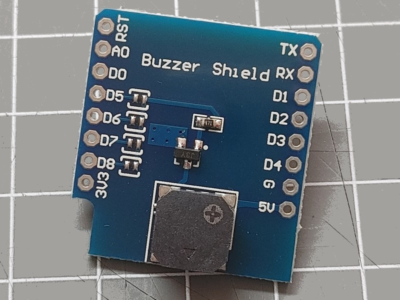
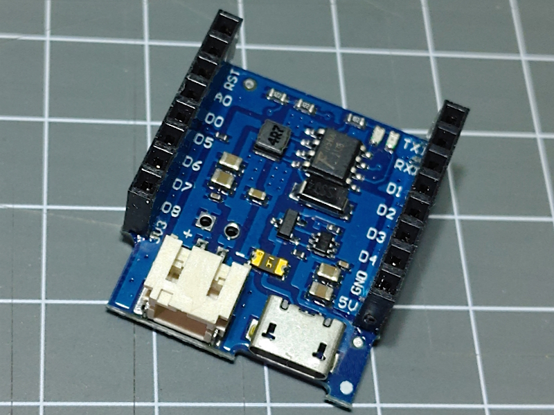




The D1 mini format for boards and shield was created by the [wemos.cc](https://www.wemos.cc/)
company and is a good base for starting with DIY devices.

There are many different mini boards available also with differend ESP processors. They all
share the position of 2 connectors with 8 pins that are compatible to a certain degree and can
be combined with the available shields.

{{ carousel([
  { "file": "d1mini.jpg", "text": "w200"},
  { "file": "d1miniv4.jpg", "text": "w200"},
  { "file": "v4.jpg", "text": "w200"},
  { "file": "v4-back.jpg", "text": "w200"},
  { "file": "d1miniesp32.jpg", "text": "w200"},
  { "file": "d1miniesp32-1.jpg", "text": "w200"},
  { "file": "d1minipins.png", "text": "w200"},
  { "file": "d1miniesp32.png", "text": "w200"},
  { "file": "stacked.jpg", "text": "w200"}
]) }}

## Pins

All the ESP8266 based boards above use the same pin assignments and are interchangeable.

Scroll the pictures above to find the pin layout for boards.

All the ESP32 offers similar pins to be used with the shields and in some cases also some additional pins outside.

## ESP8266 boards

The ESP8266 versions have been out first offering

* 11 digital input/output pins
* 1 analog input(3.2V max input)
* 3V3, 5V, GND and RST are always in the same position
* RST momentary button

Some boards offer i2c connectors.

{{ imgCard(collections.all, item = '/boards/mini/d1mini') }}


The D1 mini board labeld with **v4** uses a ESP8266 MCU and 4 MByte flash memory chip
and includes:

* USB-C connector
* i2c connector using the Qwiic standard JST SH 4-pin (1mm)
* A solder-bridge for deep sleep mode is available on the back



  The **D1 mini pro** board is based on the ESP8266 MCU and 4 MByte flash memory chip
  and includes:

* Built-in PCB antenna and External antenna connector
* Lithium battery interface, 500mA Max charging current with a PH 2.0 connector
* i2c connector using the Qwiic standard JST SH 4-pin (1mm)
* RST and GPIO16 can be connected using a solder spot on the back to support deep sleep mode.  


## ESP32 boards

There are ESP32 based boards that use the same form factor but may not be completely compatible.

### D1 mini ESP32



A similar [D1 mini ESP32 board](/boards/mini/d1miniesp32.md) exists
using a ESP32  MCU and 4 MByte flash memory chip.


## Shields

There are some shields for the board form-factor available. Here some examples:



The DHT shield with a digital temperature and humidity sensor.

This shield can be used with the [DHT Element](/elements/dht.md).




The SHT30 shield with a digital temperature and humidity sensor
can be stacked upon a board or can be attached by using a Qwiic connector cable.
<!-- to be used with the [SHT30 Element](/elements/sht20.md) -->




The SD18B20 Shield has a Dallas / DS18B20 sensor that can be used with the
[Dallas Element](/elements/dallas.md) to retrieve the local temperature.

The Data pin of the sensor is connected to D2.




The WS2812 Shield has one WS2812 LEDs that
can be addressed using the [Neo Element](/elements/light/neo.md).
<!-- The data signal for the chain of WS2812 LEDs is bound to D4. -->




The D1 Mini 8x8 RGB Shield has 64 WS2812 LEDs that
can be addressed using the [Neo Element](/elements/light/neo.md).
using the configuration `"config": "rgb"`.

The data signal for the chain of WS2812 LEDs is bound to D4.




This is a shield you can use to create and apply special configurations by soldering
components on the free grid.



 The [D1-Mini SD Card shield](/boards/mini/shield-sd.md) adds a sd card
slot for min sd cards to the standard SPI bus to be used with the
[SD Element](/elements/sd.md).

The CS assignment can be changed on the back of the shield by cutting
the default (D4) wiring and soldering a bridge for another pin.




The Buzzer Shield has a passive speaker that can be used with the
[Tone Element](/elements/audio/tone.md) to make some noise.

The buzzer can be connected to various pins by closing one of the solder pads.




The LiPo Shield enables powering a Mini board and shields using a LiPo batery.
The shield supports chaging.

