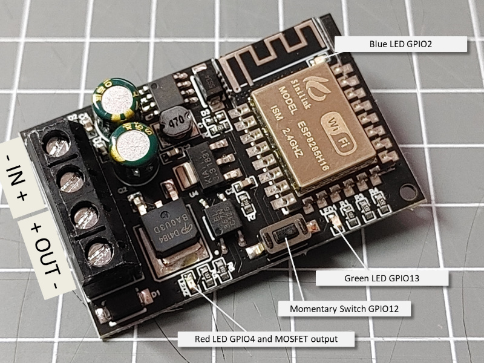

# sinilink relays module

This is a ESP8285H16 based board with an onboard MOSFET controlled output delivering the input voltage. 

It is sold as a "relay" board actually not having a relay but a MOSFET to switch the negative output pin.
It can be supplied by 5V to 36V DC.

The espressif module uses the same processor from the EPS8266 and includes an integrated 2 MByte Flash rom on the chip.

## Pins in use

red LED

green LED

blue LED

momentary switch

output

* <https://www.espressif.com/sites/default/files/documentation/0a-esp8285_datasheet_en.pdf>

## Setup and Upload

The ESP8285 modules are supported as Generic ESP8285 Modules by the Arduino environment and you can choose 2MByte Flash Size.

As there is no USB bridge available a external USB adapter has to be used for flashing the firmware for the first time.

