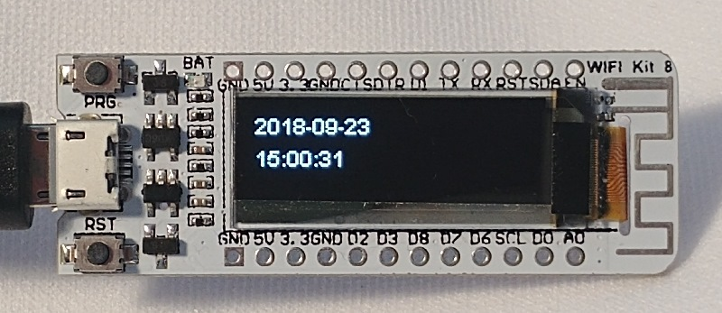

# Board Review of Wifi Kit 8 Module ESP8266 with OLED



I bought a Wifi-Kit 8 from eBay because I was searching for small size ESP8266 boards with onboard display.

The official documentation can be found at heltec.cn. There is a possibility to switch to the English language.

## Overview

Programming of this board can be done using the `NodeMCU 1.0 (ESP12-E Module)` setup of the standard boards.

The board settings and the additional features can be found here:

| Feature                   | Specific                     |
| ------------------------- | ---------------------------- |
| Display Number on I2C bus | 60 (=0x3c)                   |
| Display size              | 128 * 32                     |
| Display chip              | SSD1306                      |
| 4 Mbyte Flash             |                              |
| USB Adapter chip          | CP2104                       |
| Integrierted Charger      | LiPo batteries 3.7V          |
| Battery connector         | JST 1.25mm 2 pins            |
| Selected Board            | NodeMCU 1.0 (ESP12-E Module) |
| CPU Frequency             | 80 MHz                       |
| VTables                   | Flash                        |
| Flash Size                | 4M (1M SPIFFS)               |
| IwIP Variant              | v2 Lower Memory              |
| Debug Port                | Serial                       |
| Debug Level               | None                         |
| Erase Sketch              | Only Sketch                  |
| Upload Speed              | 115200                       |
| Builtin LED               | none                         |

Here is the connector / function Overview. Be aware hat the SCL and SDA labels are not corresponding to the I2C bus used for the OLED.

There are 2 pin diagrams on this site. BVe sure to get the right one. (see Links).

| Connector | Feature                |
| --------- | ---------------------- |
| AD        | Analog input           |
| D0        | GPIO16(D0), OLED RESET |
| SCL       | GPIO14(D5)             |
| D6        | GPIO12(D6)             |
| D7        | GPIO13(D7)             |
| D8        | GPIO15(D8)             |
| D3        | GPIO0(D3)              |
| D2        | GPIO4(D2), I2C SDA     |
| SDA       | GPIO2(D4)              |
| RX        | GPIO3(D6), RX          |
| TX        | GPIO1(D10), TX         |
| D1        | GPIO5(D1), I2C SCL     |


## OLED Display

The OLED display is the only embedded component on this board. It uses the same driver chip like the on in the
[boardwroom2](boardwroom2) board but only provides 32px in height.

The I2C bus for the display is using GPIO4 and GPIO5 and the I2C address is 0x3c.

It can used using the DisplayAdapterSSD1306 and the library „ESP8266 and ESP32 OLED Driver for SSD1306 display“.

This board also connects the RESET pin of the display. Here the GPIO16(D0) was chosen by the board designer to enable an explicit reset of the OLED driver chip.

This pin needs also requires some coding because a short LOW impulse is required to start the display properly and then the pin must be set to HIGH again during operation.

```CPP
pinMode(D2, OUTPUT);
digitalWrite(D2, LOW);  // pull low to reset OLED
delay(50);
digitalWrite(D2, HIGH); // while OLED is running, must set D2 in high
```

## OnBoard LED

There is no usable LED on board.
The orange one is connected to the MIC73831 charching circuit 

## Battery Connector

On Board is a 3.7 V Lithium battery charging circuit available. The +/- is printed on the board.
The Lipo connector is type JST with 1.25mm pin distance.
I never tried.

## Critics

The Wifi Kit 8 Module is not designed to be used for deep sleep mode.
The GPIO16(D0) pin is required to be connected to RESET to support Deep Sleep but it is also required
to be pulled to low to reset the  - causing a reset.

Anyhow, the OLED on the board requires some relevant current so long term operation on battery was not in focus for this board.

## System configuration

```JSON
{
  "device": {
    "main": {
      "name": "wifikitding",
      "reboottime": "4h",
      "description": "Wifi Kit 8 Module"
    }
  },

  "ota": {
    "main": {
      "port": 8266,
      "NOpasswd": "123",
      "description": "allow Over the Air Updates"
    }
  },

  "DisplaySSD1306": {
    "0": {
      "address": "60",
      "SDA": "D2",
      "SCL": "D1",
      "resetpin" : "D0",
      "height": 32
    }
  }
}
```
## Links

* Product page at heltec.cn: <http://www.heltec.cn/project/wifi-kit-8/?lang=en>
* Diagram <http://www.heltec.cn/download/WIFI_Kit_8_Diagram(new).pdf> Be aware that there is another diagram picture there that is wrong for my board.
* <http://www.heltec.cn/download/WIFI_Kit_Series&Instructions.pdf>
* The Wifi-Kit 8 SDK is a copy of the ESPRESSIV project and a selected list of libraries. It is a good source for ideas, however, I prefer using the golden sources of the SDK and libraries:
<https://github.com/Heltec-Aaron-Lee/WiFi_Kit_series>
* A summary to use this board <https://robotzero.one/heltec-wifi-kit-8/>

