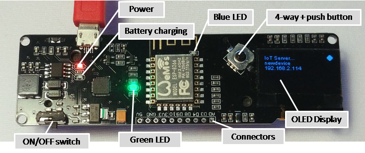

# Board Review ESP8266 -12 with OLED and 18650



This board is offered on eBay by some local and Chinese vendors and combines a ESP8266, a OLED display a „joystick“ type of button and the hardware to charge and use an LI-ION standard 18650 battery.

A battery holder is on the back.

## Overview table

| GPIO   | Pin | Functionality       | Remarks    |
| ------ | --- | ------------------- | ---------- |
|        | AD  | Analog input        |            |
| GPIO0  | D3  | Button Left         |            |
| GPIO2  | D4  | connector           |            |
| GPIO15 | D8  | connector           |            |
| GPIO3  | D9  | connector           |            |
| GPIO1  | D10 | connector           |            |
| GPIO5  | --- | SDA                 | (D1)       |
| GPIO4  | --- | SCL                 | (D2)       |
|        | --- | I2C bus for display | 60 (=0x3c) |
|        | --- | Display size        | 128 * 64   |
| Reset  |     | Button Right        |            |
| GPIO12 |     | Button UP           | (D6)       |
| GPIO13 |     | Button Down         | (D7)       |
| GPIO14 |     | Button Press        | (D5)       |
| GPIO16 |     | green LED           | (D0)       |

## Features

It is a board that combines some of the standard components available with libraries for the ESP8266 chip
in a robust and reliable way.

Because it comes with a LI-ION standard 18650 battery holder and a power management for Li-ION charging it is portable for the time the battery offers power (> 8h).

The display is using the OLED technology and the SSD1306 chip is attached using the I2C bus. A library for driving this chip is available "ESP8266 and ESP32 Oled Driver for SSD1306 display". It Supports 128x64 and 182x32 displays.

There is a green LED at GPIO16 (D0).
The blue LED on the ESP-12 can also be used GPIO2(D4).

## Critics

## Onboard LED

The green LED at GPIO16 (D0) only can be used when there is no need for deep sleep functionality and only can be switched on and off.

In cannot be dimmed using by PWM  because GPIO16 is not supporting this.

I find it a poor design to add aLED to this port for these reasons.


### joystick

The joystick button is bound to 4 input pins and to the reset pin as well this makes this button almost useless for games and menu selection functionality because it will happen by accident that the reset direction (move to the right) is activated.

### No real Low Power

The OLED display is good quality, but it is taking some power even when not used.
That makes this combination almost useless for pure battery appliances when a long lifetime is required.

### I2C / WIRE Bus

The internally used I2C Bus for the connection with the OLED is not available at a connector. Therefore it is difficult to add more I2C bus devices to this bus.

Also the board doesn't use the common and default pins that are defined by 
SCL=GPIO5(D1) and SDA=GPIO4(D2).

The board uses 

* `SCL` = `GPIO4` (`D2`) (yellow) and
* `SDA` = `GPIO5` (`D1`) (blue)

# Board configuration

The display configuration is the only specific entry in env.json:

```JSON
{
  "device": {
    "0": {
      "name": "wroomding",
      "reboottime": "1h",
      "description": "Esp-Wroom-02 Modul ESP8266 with OLED and 18650"
    }
  },

  "ota": {
    "0": {
      "port": 8266,
      "passwd": "123",
      "description": "Listen for 'over the air' OTA Updates"
    }
  },

  "ssdp": {
    "0": {
      "ModelUrl": "https://www.mathertel.de/Arduino"
    }
  },

 "DisplaySSD1306": {
    "0": {
      "address": "60",
      "SDA": "D1",
      "SCL": "D2",
      "height": 64
    }
  }
}
```
