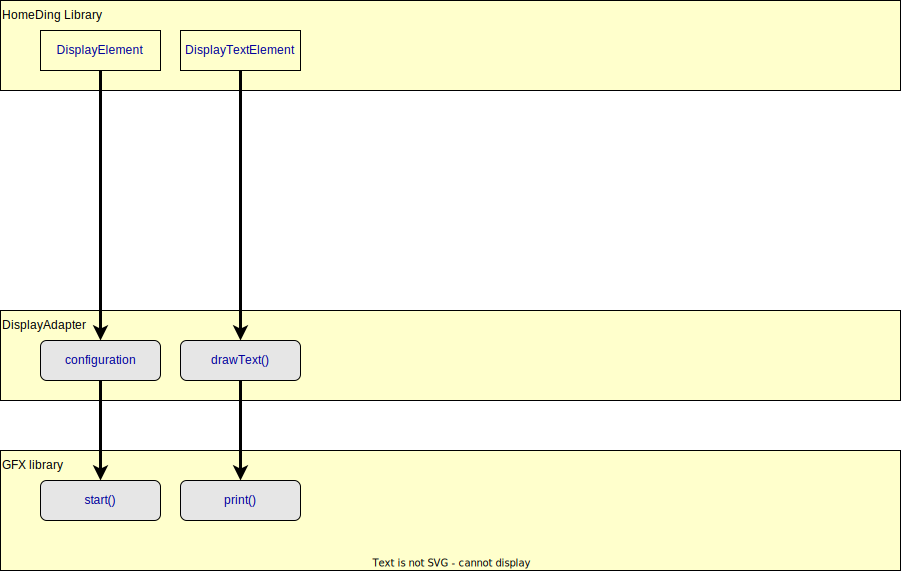
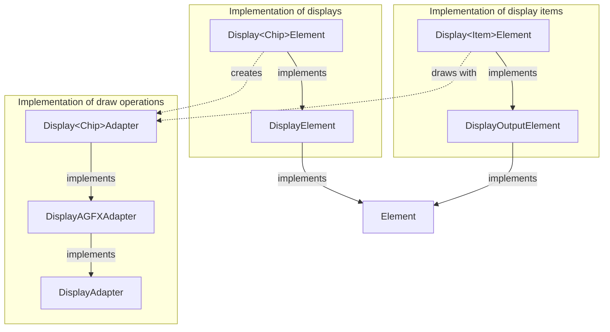

The Element implementations provided with the code in the library support display chips to create display solutions that
are text based.  The capability to display text is the minimum requirement for displays that also will be used to show
some Information during booting the device.

Beyond this minimal display support the Display Example contains more Elements that also can display various graphic al
objects and widgets but require a strong processor and more memory for drawing.

## Text only displays

Displays like the Monochrome LCDs based on the HD44780 chips are can display text characters
only. There are versions of single and multi-line displays.

See [Display LCD Element](/elements/display/lcd.md)

The display configuration is given to the display adapter by the display element and the drawing
function for text has to be implemented by the display adapter or the appropriate GFX library.

The DisplayAdapter interface is common to all displays.  Some displays like the simple LCD displays need no GFX but a
display specific library and must implement the start and drawText as a minimum.

The character width and height will be 1 for these displays and the displayBox width and height is reporting how many
characters can be shown.

The default implementations in the DisplayAdapter class will calculate all characters with 1 unit for width and height
So they must not be overwritten for pure text displays.

A specific display adapter implementation must derive from the `DisplayAdapter` class and override at minimum the funcions:

* `fillRect()` -- used for clearing the text on the display.
* `drawText()` -- print some text on the display.

You can override to gain some speed:

* `clear()` -- to clear the complete display with the background color.

## Pixel based displays

Pixel based displays work different and need more CPU and memory.  Most of the displays today are pixel oriented.  This
requires at minimum a standard font for the characters in use.

In addition to the functions required for text only displays the functions `setPixel()` and `getPixel()` must be
supported. Some GFX implementations offer drawing of simple rectangles and lines but these funcions are not used by the HomeDing Library.
Instad the GFXDraw library is used to draw even complex objects.

The following methods have to been implemented for Pixel based displays:

* `fillRect()` -- used for clearing regions on the display.

* `textBox()` -- to return the size of a text on the screen.
* `drawText()` -- print some text on the display.

* `startWrite()` -- to be called once before calling `writePixel()`
* `writePixel()` -- set the color of a pixel. Position must be guaranteed to be on the screen.
* `endWrite()` -- to be called once after calling `writePixel()`

### Text font support

At a minimum these displays have to support the drawText function with a standard font to act as a display that can be
used showing the welcome messages at startup. The specific display adapter may also include multiple fonts to fit best to the required text height.
With text height 0 the default height (usually the smallest) should be used.

### Color Support

Colors in the interface to a displayAdapter are always 32 bit 0xxrrggbb color values.  The first byte (xx) is not used.

To support colors or at least black or white backgrounds the display configuration can capture settings for a default
foreground and background color.

Black/white displays usually use the colors 0x00FFFFFF (white) and 0x00000000 (black) only.  For other displays it is
the DisplayAdapter implementation that can decide the best real color for drawing.

In case the display doesn't allow to read back the current color of a pixel the `getPixel()` will return the background
color as defined in the configuration.

<!-- These colors can be retrieved by using the functions `getColor()` and `getBackgroundColor()`. -->

For drawing anything to the screen the stroke and fill colors always have to be passed in the function parameter.

---

## Implementations

The C++ Classes used for display drivers for specific chips and the display item shown on the
display are illustrated in the following class diagram:

The `Display<Chip>Adapter` implementations include using various display types. They are
created and initialized by the corresponding `Display<Chip>Element` class.

The `DisplayAGFXAdapter` is a base implementation for display drivers from the Arduino_GFX library. This library supports various chips and is very similar to the Adafruit GFX library.

The `DisplayOutputElement` is a base implementation for Elements shown on the display.

The full list of Elements for using displays can be found in the [Display Elements](/elements/display/index.md) documentation.

