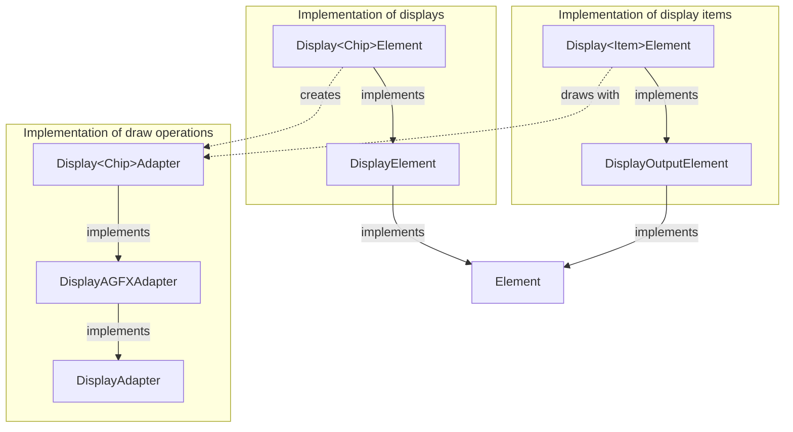

The C++ Classes used for display drivers for specific chips and the display item shown on the
display are illustrated in the following class diagram:

The `Display<Chip>Adapter` implementations include using various display types. They are
created and initialized by the corresponding `Display<Chip>Element` class.

The `DisplayAGFXAdapter` is a base implementation for display drivers from the Arduino_GFX library. This library supports various chips and is very similar to the Adafruit GFX library.

The `DisplayOutputElement` is a base implementation for Elements shown on the display.

The full list of Elements for using displays can be found in the [Display Elements](/elements/display/index.md) documentation.

