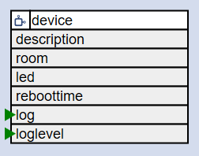

# The Device Element ???

The DeviceElement allows configuration of the behavior of the device and it's features.



Because there is only one device configuration the full id is always `/device/0`.
When the web server is active you can reach the device using http://{name}.
This name is specified in the device configuration and is used by some of the elements.

## Element Configuration

The following properties are available for configuration of the element:

| Property      | Description                                                                                       |
| ------------- | ------------------------------------------------------------------------------------------------- |
| `name`        | The device name is used to register the device on the network.                                    |
| `reboottime`  | Specifies the duration after the device is rebooted to fully clean up the memory.                 |
| `description` | A line of description used in the web UI.                                                         |
| `connecttime` | The available time after a reboot of the device to start network configuration. Default is "10s". |
| `connectmode` | The priorities of the network connection options. Default is "LAST,AP"                            |
| `led`         | The GPIO pin of the system LED. Defaults is `no LED`.                                             |
| `button`      | The GPIO pin of the system button. Defaults is 'GPIO0(D3)'                                        |

Detailed description for `ConnectTime`, `ConnectMode` and `LED` see [WiFiManager](wifimanager).

## Configuration Example

```JSON
"device": {
  "0": {
    "name": "wmleaks",
    "reboottime": "12h",
    "description": "Monitor water leaks at the washing machine"
  }
}
```

## See also

* [WiFiManager](wifimanager)