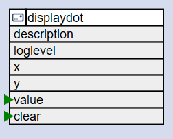

# The DisplayDot Element

The DisplayDotElement allows sending a boolean value to the display and place it at a specified position as a shallow or filled dot.
The value to be displayed can be changed by passing the new value using an action.



Because there may be more values presented on a display at the same time the 
DisplayDotElement may exist multiple times in the configuration by using different positions.

It is not required for all displays to support all these Elements and when a device only has a simple LCD
attached maybe only using the DisplayTextElements is appropriate.

You can even use the DisplayDotElement without having an actual Display attached that supports it.

The DisplayDotElement is included in the collection of core elements.

## Element Configuration

The following properties are available for configuration of the element:

| Property | Description                             |
| -------- | --------------------------------------- |
| `x`      | Specifies the x position of the text.   |
| `y`      | Specifies the y position of the text.   |
| `value`  | This value will be send to the display. |

## Element State

The following properties are available with the current values at runtime

| Property | Description                       |
| -------- | --------------------------------- |
| `value`  | The actual value to be displayed. |

## Example for Configuration

```JSON
"displayDot": {
  ???
```

## Example State

```JSON
"displayText/on": {
  "value":"true",
  "temperature":"27.30",
  "humidity":"50.50"
},
```

