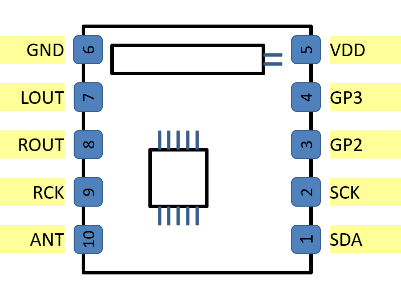
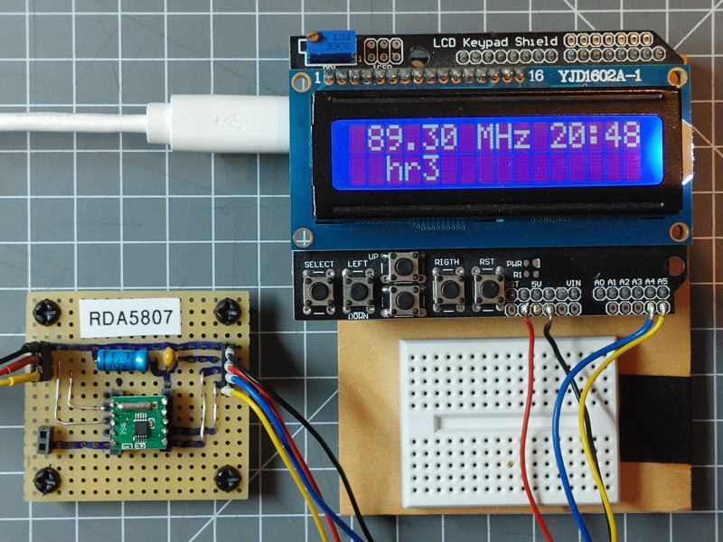

The RDA5807 radio chip is available in several variants.

It supports the following features

* FM in range 50 - 115 MHz
* RDS Information
* Output Volume control
* Digital adaptive noise cancellation
* Bass Boost
* Analog Line Level Output.
* Frequency spacing 25KHz, 50KHz, 100KHz, 200KHz
* Programmable de-emphasis (50/75 µs)
* I2C Control

The RDA5807 radio chip is one of the radio chips supported by the [Radio Library].

## RDA5807M Module

The RDA5807 radio chip is available on small boards including the resonator and some capacitors
that can easily be used by soldering wires or connector pins to it.

{ style="width: 200px" }

## RDA5807M Module with LCD Example

## See also

* [Radio Element]
* [Radio example](/examples/radio.md)

[Radio Library]:http://www.mathertel.de/Arduino/RadioLibrary.aspx
[Radio Element]:/elements/audio/radio.md
