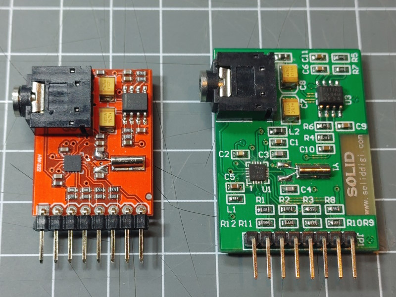
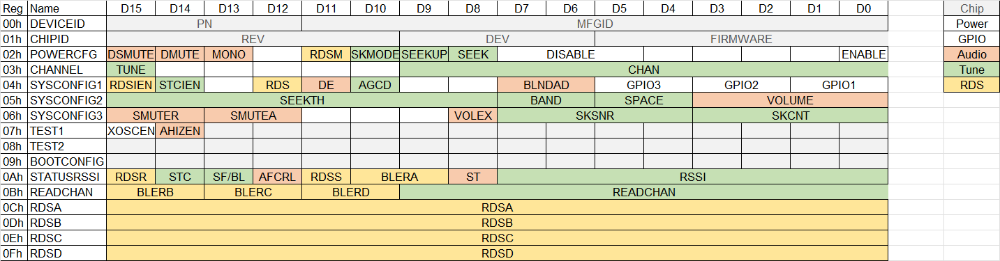

The SI4703 supports the following features

* FM in range 76 - 108 MHz
* RDS Information
* Output Volume control
* Digital adaptive noise cancellation
* Analog Line Level Output.
* Frequency spacing 50KHz, 100KHz, 200KHz
* Programmable de-emphasis (50/75 µs)
* I2C Control

The SI4703 radio chip is one of the radio chips supported by the [Radio Library].


## SI4703 Modules

There are multiple variants if modules with a si4703 radio chip available. Here 2 versions I got.
They both have a SI4703 but with different Firmware versions. The first 4 numbers on th chip will tell you:

* `0316` is a SI4703 with Firmware 16 (on the left)
* `0319` is a SI4703 with Firmware 19 (on the right)

Both work.




## Starting with a SI4703 module

The `TestSI4703` example is a good starting sketch for your setup before adding maybe more peripherals.
It shows that the radio chip can tune a fixed Frequency.

A SI4703 module has to be connected by using the following connections:

| Signal       | Arduino UNO | ESP8266 | ESP32 | Radio chip signal |
| ------------ | ----------- | ------- | ----- | ----------------- |
| VCC (red)    | 3.3V        | 3v3     | 3v3   | VCC               |
| GND (black)  | GND         | GND     | GND   | GND               |
| SCL (yellow) | A5 / SCL    | D1      | 22    | SCLK              |
| SDA (blue)   | A4 / SDA    | D2      | 21    | SDIO              |
| Reset        | D2          | D5      |       | RST               |

The Reset signal is somehow special for this chip and must be connected as it is used together with the SDA line
in the startup phase to tell the chip to use the I2C protocol.

These two signals also mut be configured to the radio class before calling the `initWire` function
and the Wire interface must not be used before.

``` cpp
// SI4703 special pins.
radio.setup(RADIO_RESETPIN, RESET_PIN);
radio.setup(RADIO_MODEPIN, MODE_PIN);
```

Change the Station in the sketch to a frequency with a signal that is strong on your place and upload.


## Using SI4703 Modules with other Examples

In the other examples you may have to activate the line that uses a SI4703 Class for the global radio variable.

Also make sure that the SI4703 special pins RESET and SDA are configured.


## Register Overview




## See also

* [Radio Element]
* [Radio example](/examples/radio.md)
* <https://www.skyworksinc.com/en/Products/Audio-and-Radio/Si4702-03-FM-Radio-Receivers/Si4703>


[Radio Library]:http://www.mathertel.de/Arduino/RadioLibrary.aspx
[Radio Element]:/elements/audio/radio.md
