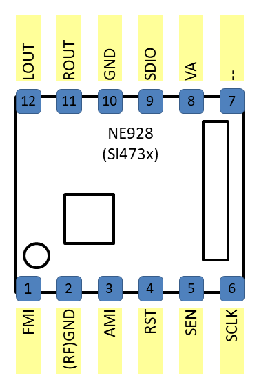
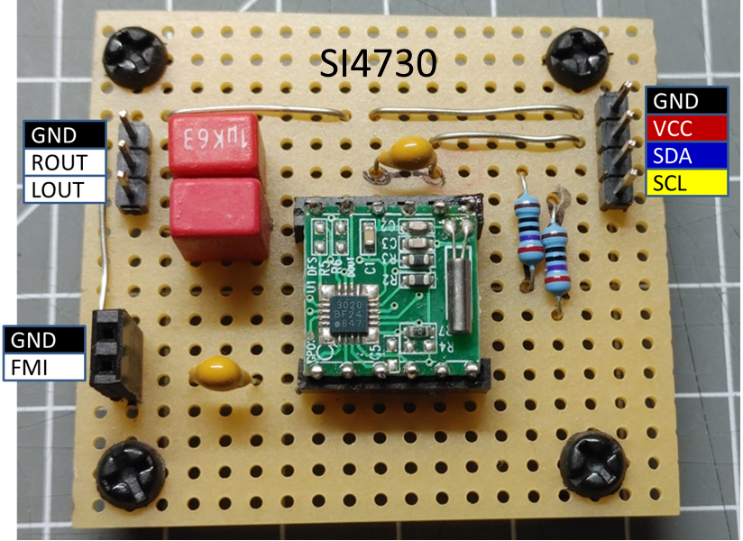

The SI47xx radio chips are available in several variants.
The following variants are supported (and where tested) with the [Radio Library]:

* SI4721
* SI4730

It supports the following features:

## SI4721 Module from sparkfun

The si4721 radio chip was tested and adopted using the board from sparkfun you can find here:
<https://www.sparkfun.com/products/15853>.

This chip also supports sending FM signals, there is a special example 'TransmitSI4721.ino' to show this functionality.
in the radio library but is not supported by the [Radio Element].

## SI4730 Module NE928

The NE928 Module is available with different SI47xx chips variants.
This one is mounted with a si4730 version.

The pins assignment of the module is:

{ style="width: 200px" }

With some capacitors for the audio output and vcc and pull up resistors
for the I2C bus it can be controlled using the Radio Library and the [Radio Element].

{ style="width: 200px" }

## See also

* [Radio Element]
* [Radio example](/examples/radio.md)

[Radio Library]:http://www.mathertel.de/Arduino/RadioLibrary.aspx
[Radio Element]:/elements/audio/radio.md
