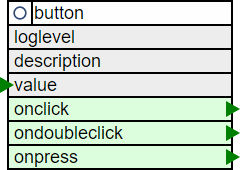

# The Button Element

The ButtonElement allows detecting multiple button press gestures like
* single short click
* double click
* long press

The input can come from a digitalin[Digital Input Element](/elements/digitalin) or anynother element that generates boolean alike values.

It can also be used to define a Button Element in the Web UI of the device.



## Web UI for the Button Element

There is a dedicated card for this element available that will be used for the web server config and landing pages:


Pressing the button will trigger the events defined in the configuration.

## Element Configuration

The following properties are available for configuration of the element:

| Properties    | Description                                                          |
| ------------- | -------------------------------------------------------------------- |
| value         |                                                                      |
| clicktime     | time to wait for another click before sending out the onclick action |
| presstime     | time to wait before sending out the onpress action                   |
| onclick       | A single press gesture was detected.                                 |
| ondoubleclick |                                                                      |
| onpress       |                                                                      |

## Control the Element

It is typical to use the Button Element together with a [Digital Input Element](/elements/digitalin)
that provides the input value to the Button Element.

## Example Configuration

```JSON
{
  "digitalin": {
    "0": {
      "onvalue": "button/c?input=$v"
    }
  },

  "button": {
    "start": {
      "pin": "14",
      "type": "TOGGLE",
      "inverse": "true",
      "onon": "device/main?log=start.",
      "onoff": " device/main?log=stop."
    }
  }
}
```

<!-- The Button Element can also be used without a physical input signal by using the Web UI only.

| Action | Description                                                |
| ------ | ---------------------------------------------------------- |
| input  | Receiving this action sets the input level to high or low. |
-->


## Element State

The following properties are available with the current values at runtime

| Property | Description                                |
| -------- | ------------------------------------------ |
| `active` | Is set to true when the Element is active. |


## Example State

```JSON
"button/start": {
  "active": "true",
  "value": "1"
}
```