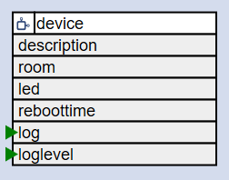

# The Device Element

<div class="excerpt">
  
  <p>The DeviceElement allows configuration of the behavior of the device and the features offered by the board class.</p>
</div>




By specifying the configuration for the `device/0` element the general settings for the device can be controlled.

## Element Configuration

The following properties are available for configuration of the element.

### Basic settings

**name** - The device name is specifying zhe hostname that is used to register the device on the network. The device can be accessed by any browser on the same network using the URL `http://<name>`.

**reboottime** - Specifies the duration after the device is rebooted to fully clean up the memory.

**description** - A line of text that gives a short description of the device used in the web UI.

**room** - The location of the device.

**loglevel** - By specifying a loglevel for the device **all** elements will use this loglevel to output debug messages over the serial interface and into the system log file. See also [Device Logging](logger).

### WiFi-Manager and Startup settings

**led** - The GPIO pin of the system LED. Defaults is `no LED`.

**button** - The GPIO pin of the system button. Defaults is 'GPIO0(D3)'

**connecttime** - The available time after a reboot of the device to start network configuration. Default: "6s".

**homepage** - When the device starts in normal mode this page will be shown when opening the device web UI using the url without specifying the page. This defaults to `/index.htm` 

| Property      | Description                                                                                     |
| ------------- | ----------------------------------------------------------------------------------------------- |
| `title`       | short title to be displayed in the web UI                                                       |
| `logfile`     | set to 1 to enable storing lines from the system log to files. default: 0                       |

Detailed description for `ConnectTime`, `button` and `led` see [WiFiManager](wifimanager).

## Configuration Example

```JSON
"device": {
  "0": {
    "loglevel": 1,
    "name": "wmleaks",
    "title": "Water Leakage",
    "description": "Monitor water leaks at the washing machine",
    "room": "Celler",
    "reboottime": "24h",
    "led": "D0",
    "button": "D3",
    "homepage": "ding-info.htm",
    "logfile": 1
  }
}
```

## See also

* [WiFiManager](/wifimanager)
* [Device Logging](logger)