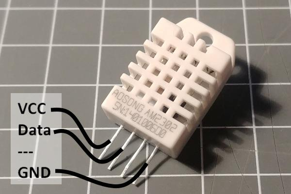
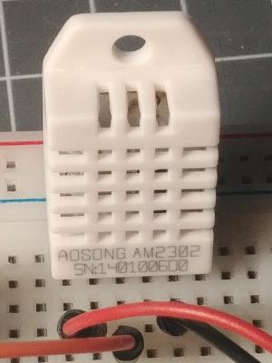

# The DHT Element

::: excerpt dht
The DHTElement allows retrieving temperature and humidity values from the DHT family sensors and creates actions when new values are available.
:::

The current values are also sent out to other elements using actions when they stay the same for some time to allow remote devices to resume to the current values after reboot or network outages.

 


## Web UI for the DHT Element

There is a dedicated card for this element available that shows the actual temperature and humidity.


## Using the DHT Element

The DHT Element is not part of the core set of elements because the low level communication to the chips the `DHTesp` library is used and needs to be installed using the Arduino library manager.

Install the `DHT sensor library for ESPx` library by beegee-tokyo before including this element.

The ***HOMEDING_INCLUDE_DHT*** must be defined in the main sketch to compile and register the element.

```CPP
// Use some more Elements that need additional libraries
#define HOMEDING_INCLUDE_DHT
#include <HomeDing.h>
```

<!-- The DHT Sensor example shows how to configure a sensor device that reads the sensor values from a DHT and shows them in the Web UI. -->

The following sensor chips from the DHT family are supported by the DHTesp library:

* DHT11
* DHT22
* AM2302
* RHT03

more details can be found at <https://github.com/beegee-tokyo/DHTesp>

## Connecting a Sensor

The sample configuration coming with the DHT22 recipes is configured to use a DHT22 type of sensor with the data line attached to GPIO2(D4).

    ESP8266 board     DHT22
    GND ------------- (4) GND
    3.3v ------------ (1) VCC
    GPIO2(D4) ------- (2) Data
    
| ESP8266   | DHT22 | Description  |
| --------- | :---: | ------------ |
| 3.3v      |   1   | Power Supply |
| GPIO2(D4) |   2   | Data         |
| GND       |   4   | Ground       |

The configuration can be changed easily by modifying the config.json file.

## Element Configuration

The following properties are available for configuration of the element:

**pin**\* - Specifies the hardware number of the pin that is used to connect the DHT sensor for data.

**readtime** - Time between 2 probes for temperature and humidity being fetched from the sensor. Default value is 1m.

**type** - The type of the sensor. Values are: "DHT11", "DHT22" and "AUTO"

**resendTime** - The current values of the probe are resent after this specified time even when not changing.

**onTemperature** - These actions are emitted by the element when the temperature gets a new value. The action will not be sent when reading ne sensor values that stay the same.

**onHumidity** - These actions are emitted by the element when the humidity gets a new value. The action will not be sent when reading ne sensor values that stay the same.


\* This parameter must be specified.

### Example for Configuration

```JSON
{
  "dht": {
    "on": {
      "pin": "D4",
      "type": "DHT22",
      "readtime": "30s",
      "resendtime": "2m",
      "onTemperature": "device/0?log=temp: $v\u00dfC",
      "onHumidity": "device/0?log=hum: $v%"
    }
  }
}
```

## Element State

The following properties are available with the current values at runtime

**active** - Is set to true when the Element is active.

**temperature** - The last read temperature value from the sensor.

**humidity** - The last read humidity value from the sensor.


### Example State

```JSON
{
  "dht/on": {
    "active":"true",
    "temperature":"27.30",
    "humidity":"50.50"
  }
}
```

## Implementation Details

The implementation uses the DHTesp / `DHT_sensor_library_for_ESPx` library from beegee_tokyo. You need to load this library using the library manager or get it directly from
<https://github.com/beegee-tokyo/DHTesp>

More documentation can be found at:
<https://desire.giesecke.tk/index.php/2018/01/30/esp32-dht11/>

The chip is designed to run on 3.3 - 6.0 volts with a typical voltage of 5 volts.
It has been observed that when operating on 3.3 volts the chip sometimes gets out of order and needs a reset by disconnecting and reconnecting the sensor from the VCC. Before reading data 1 second waittime is required.

As the sensor has a sensor period of 2 seconds it doesn't make sense to read the values from the sensor more frequently.


## more

* DataSheet:
<https://www.sparkfun.com/datasheets/Sensors/Temperature/DHT22.pdf> and
<https://cdn-shop.adafruit.com/datasheets/Digital+humidity+and+temperature+sensor+AM2302.pdf>


* 10K VCC - Data

* Enable Shut down of sensor by supplying power through an output pin.

https://forum.arduino.cc/index.php?topic=355137.0
