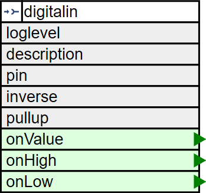

# The Digital Input Element

The DigitalInElement is used to capture digital input signal and create actions based on level changes.



The physical input level can differ from the logical input level. E.g. momentary input buttons may pull an input down to ground while others pull them up. Also switches can be used with this Element.

## Element Configuration

The following properties are available for configuration of the element:

| Property  | Description                                                                                                                                 |
| --------- | ------------------------------------------------------------------------------------------------------------------------------------------- |
| `pin`*    | Specifies the hardware number of the pin.                                                                                                   |
| `inverse` | In normal mode a HIGH input value is reported as value 1. In inverse mode a LOW input value is reported as value 1. Normal mode is default. |
| `pullup`  | When defining with true the internal pullup resistor for the input pin will be activated.                                                   |
| `onHigh`  | Actions.<br/>These actions are emitted when the logical level is switched to `1`.                                                           |
| `onLow`   | Actions.<br/>These actions are emitted when the logical level is switched to `0`.                                                           |

\* This parameter must be specified.


## Element State

The following properties are available with the current values at runtime

| Property | Description                                |
| -------- | ------------------------------------------ |
| `active` | Is set to true when the Element is active. |
| `value`  | Current logical value of the button input. |


## Example Configuration

```JSON
"digitalin": {
  "start": {
    "pin": "D7",
    "inverse": "true",
    "pullup": "true",
    "onHigh": "device/0?log=start.",
    "onLow": " device/0?log=stop.",
    "onValue": "device/0?log=input($v)"
  }
}
```


## Example State

```JSON
"digitalin/start": {
  "active": "true",
  "value": "1"
}
```

# See also

* [Switch Element](switchelement)
