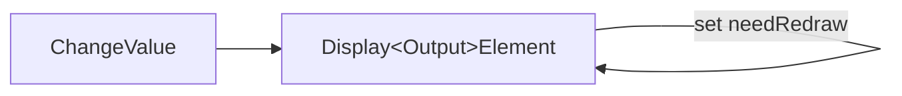
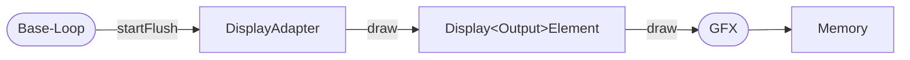

# Displays using a GFX Library

The display drivers for pixel based displays in the HomeDing Library
are using drivers based on a GFX library.

The functionality of the GFX library is used to "draw" all kind of simple things to the displays like pixels, lines, rectangles
and pure text. This is often done by having a equivalent of the display memory in a main memory buffer.

## How drawing is implemented

Creating information and objects on the display is implemented by creating DisplayOutputElements and modifying their properties
as required. These changed Elements will be marked for a later redraw activity only so no direct drawing is done.

When the current actions all have been delivered and there are no pending actions in the board the real drawing will be started.

Some display chip specific implementations directly change the memory of the display, some will update an internal copy of the display memory.

After all Output Elements are drawn the flush is initiated from the Display Adapter.

After drawing all visible elements to the memory using the GFX bultin functions the Display Chip specific implementation uses a
bus like I2C, SPI or 16-bit data to flush the updated memory into the chip.

## GFX Library

There are several GFX library implementions for Arduino available

* [Adafruit GFX Library](https://github.com/adafruit/Adafruit-GFX-Library)
* [LovyanGFX](https://github.com/lovyan03/LovyanGFX)
* **[GFX Library for Arduino](https://github.com/moononournation/Arduino_GFX)**

These libraries provide very similar functionality but cover different display types and communication busses.

The HomeDing library today uses the GFX Library for Arduino as it has specific bus implementations for ESP32 based devices
and I2C bus support together with small displays was added.

## Display Adapter

Between the DisplayOutputElement and the GFX library the DisplayAdapter (for GFX) offers some primitive drawing functions. These
are used by the DisplayOutputElements as they check some HomeDing specifics:

The GFX libraries differ in their implementation in detail and some primitives are using bounding box parameters others with and
height. This is unified by the adapter drawing functions.

* When the key colors RGB_UNDEFINED or RGB_TRANSPARENT are used for drawing, the GFX functions are not called.
* When the coordinates are outside the display area the GFX functions are not called.
* The signature of the darwing functions use a boundingBox parameter where applicable.

## Color parameters for Output Elements

Output Element can be configured with 3 color properties: color, background and border. These are use as default values for all
configured Output Elements.

The color "none" can be used to remove the color value.

Internally there are 2 key colors (`RGB_UNDEFINED` and `RGB_TRANSPARENT`) used for undefined and transparent. Both will result
in NOT drawing the text/border/background, ...

| Output Element | "color":   | "background":    | "border":    |
| -------------- | ---------- | ---------------- | ------------ |
| Line           | line color |                  |              |
| Text           | text color | background color | border color |
| Rect           |            | background color | border color |
| Button         | text color | background color | border color |

## Using Display Output Elements

The DisplayItems are the Elements to configure what should be drawn on the display.

Part of the core library you have

* [Display Text Element]
* [Display Dot Element]
* [Display Line Element]
* [Display Rect Element]
* [Display Button Element]

The [Display Text Element] can also be used with the simple displays that can show text only like the [LCD Display](/elements/display/lcd.md). These displays are not using a GFX library.

<!--
In the Display Example you can find
* [Display Bar Element]
-->

## Drawing on the display

It is possible to directly draw objects on the GFX display. When changing a value or the pointer of a clock, you need to erase
the existing drawings by changing the pixels to a defined background color before the new drawing.

But things get more complex when overlapping objects must be drawn. The object in the background must be drawn even when not
changed. Also when changing a background object the objects in the front must be drawn again.

Here the declarative nature of elements helps by just marking elements with changed properties as to be redrawn and coordinate
the effective drawing of all overlapping objects.

In the base class DisplayAdapter the `startFlush` function first calculates the combined bounding box of the Elements that have
been changed and then draws all Elements that are at least partly inside this box in the correct order.

## Flush data to the display

There are displays that allow a fast way of sending data to the display chip that is shown immediately like on TFT panels. On
the other hand there are e-paper displays that require some seconds for update and frequent updates should be avoided.

To reduce the number of transfers of the changed data to the display the flush() operation is not directly triggered by the
drawings but will be triggered when there is no current action pending for delivery.

The display adapter can check if the display needs some redraw before transferring the data. For displays like E-Paper it is
possible to delay the data transfer even further by using the `delayflush` parameter.

A good documentation of a GFX library can be found at <https://learn.adafruit.com/adafruit-GFX-graphics-library>.

<https://github.com/adafruit/Adafruit_EPD/blob/master/src/Adafruit_EPD.cpp>

## See also

* [Fonts](fonts.md)
* <https://learn.adafruit.com/adafruit-GFX-graphics-library>

[Display Text Element]: /elements/display/text.md
[Display Dot Element]: /elements/display/dot.md
[Display Line Element]: /elements/display/line.md
[Display Rect Element]: /elements/display/rect.md
[Display Button Element]: /elements/display/button.md
