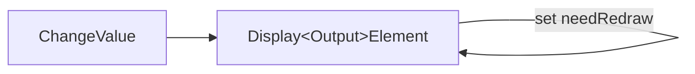
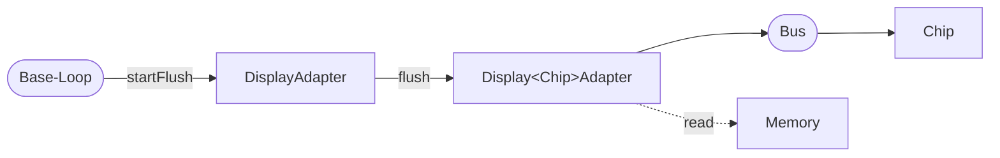

# Displays using a GFX Library

The display drivers for pixel based displays in the HomeDing Library are using display driver implementation based on a GFX library.

The typical functionality of a GFX library is to "draw" all kind of simple things to the displays like pixels, lines,
rectangles and pure text.  This is often done by having a equivalent of the display memory in a main memory buffer but
sometimes the drawn pixel are sent to the device as they are drawn.

However the drawing functions directly use the driver implementation and therefore lack of some possibilities required for several cases:

* When only a part of a widget is required to be drawn a clipping area or rectlangle cannot be applied to avoid drawing on same pixels.
* ome drivers always send the whole display memory to the display requiring a lot of CPU cycles and time.
* Drawing primitives can use solid colors only.

The HomeDing library includes several Elements for Widget implementations that draw by using callback functions as
described in the [gfxDraw Library](https://github.com/mathertel/gfxDraw).

The GFX library that includes the display specific output routines and bus drivers must only support a setPixel function.

To display multiple elements / Widgets on one display 2 different drawing modes are implemented:

## Simple drawing mode

This drawing implementation fits good into devives with limited cpu and memory capacities.

It is optimized for drawing simple graphic elements on the device without the need to buffer the current display in memory.

Drawing a graphic element is assuming the following situation:

* None of the elements do overlap with their drawing areas / bounding boxes.
* There is a common background color for all elements.
* Elements can „erase“ any previous drawing by simply filling the full drawing area with the background color and do a full redraw.

With these conditions drawing widgets may do their internal optimization to avoid full drawing sequences.

* All elements that are marked for redraw are drawn in any order.
* When a new logical page is displayed the surface is erased with the background color and all widgets on the page are drawn.

## Full drawing mode

This drawing implementation fits good for devices that offer enough resources for complex graphical elements.

This includes drawing overlapping elements with the support of current clipping areas and dynamic bounding boxes.

* All elements that are marked for redraw will trigger the redraw of all objects covering the area in the order defined by the configuration.
* The display implementation offering the getColor(x,y) functionality can be used.
* The clipping box will be set ao widgets will be able to optimise drawing by only setting pixels within the clipping area.
* Any drawing outside the clipping area will not be effective.

SetPixel

GetPixel
Set clipping area

## How drawing is implemented

To show information on a display a set of widgets aka. DisplayOutputElements is available.

By setting the properties or values of these Elements they are marked to be drawn on the display and the DisplayAdapter implementation has also been flagged for redraw.

This allows changing multiple properties at the same time without intermediate draw activity and especially helps combining changes
on slow displays like E-Paper displays.

Drawing starts when no action is queued in the board and the loop function of all elements has been called.

Some display chip specific implementations directly change the memory of the display, some will update an internal copy of the display memory.

After all Output Elements are drawn the flush() is initiated from the Display Adapter to send the buffered copy to the display for the displays using a display memory copy.

The communication to the Display Chip
uses a
bus like I2C, SPI or 16-bit data to flush the updated memory into the chip.

## GFX Libraries

There are several GFX library implementions for Arduino available that are used to draw text, lines
and fill rectangles.

* [Adafruit GFX Library](https://github.com/adafruit/Adafruit-GFX-Library)
* [LovyanGFX](https://github.com/lovyan03/LovyanGFX)
* **[GFX Library for Arduino](https://github.com/moononournation/Arduino_GFX)**
* [honeythecodewitch.com/gfx](https://github.com/codewitch-honey-crisis/gfx)

These libraries provide very similar functionality but cover different display types and communication busses.

The HomeDing library today uses the GFX Library for Arduino as it has specific bus implementations for ESP32 based devices
and I2C bus support together with small displays was added.

## Display Adapter

Between the DisplayOutputElement and the GFX library the DisplayAdapter (for GFX) offers some simple drawing functions. These
are used by the DisplayOutputElements as they check some HomeDing specifics:

The GFX libraries differ in their implementation in detail and some primitives are using bounding box parameters others with and
height. This is unified by the adapter drawing functions.

* When the key colors RGB_UNDEFINED or RGB_TRANSPARENT are used for drawing, the GFX functions are not called.
* When the coordinates are outside the display area the GFX functions are not called.
* The signature of the drawing functions use a boundingBox parameter where applicable.

## Using Display Output Elements

The DisplayItems are the Elements to configure what should be drawn on the display.

Part of the core library you have

* [Display Text Element]
* [Display Dot Element]
* [Display Line Element]
* [Display Rect Element]
* [Display Button Element]

The [Display Text Element] and [Display Dot Element] can also be used with the character based displays that can show text only like the [LCD Display](/elements/display/lcd.md). These displays are not using a GFX library.

## Color parameters for Display Output Elements

The Display Output Elements can be configured with 3 color properties: `color`, `background` and `border`. These are used as default values for all
configured Output Elements.

The color "none" can be used to remove the color value.

| Output Element | "color":   | "background":    | "border":    |
| -------------- | ---------- | ---------------- | ------------ |
| Line           | line color |                  |              |
| Text           | text color | background color | border color |
| Rect           |            | background color | border color |
| Button         | text color | background color | border color |

## More Display Output Elements

The [Display Example] folder has an advanced set of Display Output Elements that can be used with the ESP32 processors that allow more resource consuming drawings.

They are implemented by using the (internal)    [gfxDraw Library]  that supports vector oriented drawings on top of a GFX library.

See [gfxDraw Library] for further details.

<!--
In the Display Example you can find
* [Display Bar Element]
-->

## Drawing on a gfx display

It is possible to directly draw objects on the GFX display. When changing a value or the pointer of a clock, you need to erase
the existing drawings by changing the pixels to a defined background color before the new drawing.

But things get more complex when overlapping objects must be drawn. The object in the background must be drawn even when not
changed. Also when changing a background object the objects in the front must be drawn again.

Here the declarative nature of elements helps by just marking elements with changed properties as to be redrawn and coordinate
the effective drawing of all overlapping objects.

In the base class DisplayAdapter the `startFlush` function by default first calculates the combined bounding box of the Elements that have
been changed and then draws all Elements that are at least partly inside this box in the correct order.

This approach works fine when elements are placed on background elements that support
rendering using a clipping rectangle.

Especially the rect Element can be used as a background for text Elements.

When drawing an Element

## Flush data to a display

There are displays that allow a fast way of sending data to the display chip that is shown immediately like on TFT panels. On
the other hand there are e-paper displays that require some seconds for update and frequent updates should be avoided.

To reduce the number of transfers of the changed data to the display the flush() operation is not directly triggered by the
drawings but will be triggered when there is no current action pending for delivery.

The display adapter can check if the display needs some redraw before transferring the data. For displays like E-Paper it is
possible to delay the data transfer even further by using the `delayflush` parameter.

A good documentation of a GFX library can be found at <https://learn.adafruit.com/adafruit-GFX-graphics-library>.

<https://github.com/adafruit/Adafruit_EPD/blob/master/src/Adafruit_EPD.cpp>

## See also

* [Fonts](fonts.md)
* <https://learn.adafruit.com/adafruit-GFX-graphics-library>

[Display Text Element]: /elements/display/text.md
[Display Dot Element]: /elements/display/dot.md
[Display Line Element]: /elements/display/line.md
[Display Rect Element]: /elements/display/rect.md
[Display Button Element]: /elements/display/button.md
[gfxDraw Library]: /gfxdraw-library.md
