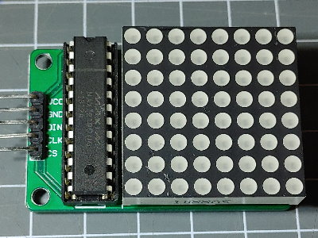
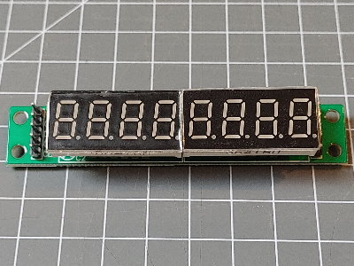

The MAX7219 is using the SPI interface and protocol to receive commands and data.

It can either display a 8*8 bit pattern on a dot matrix or a numeric value with 7 segment display.




## Element Configuration

The following properties are available for configuration of the element:

**value** - The value given as an input to the element can be either a 8 byte value using the format 0x1122334455667788 in `8x8` mode or a string with a number including decimal point when in `numeric` mode

**clear** - a clear action will disable all leds.

**cspin** - The pin for the cs signal line.

**brightness** - The brightness of the display in range 0..16.

**mode** - `8x8` or `numeric`.


### Configuration Example

This example shows how to configure this element:

``` json
{
  "max7219": {
    "0": {
      "title": "wordclock matrix",
      "cspin": "D3",
      "brightness": 2,
      "mode": "8x8"
    }
  }
}
```


### Connecting the MAX7219

The MAX7219 is using the SPI interface and protocol to receive commands and data. There is no data sent by the MAX7219.

Here D3 is used for selecting (enabling) the chip.

| ESP8266   | ESP32     | MAX7219       |
| --------- | --------- | ------------- |
| D3        | 5         | CS            |
| D5 (SCK)  | 18 (SCK)  | CLK           |
| D6 (MISO) | 19 (MISO) | not connected |
| D7 (MOSI) | 23 (MOSI) | DIN           |
| +5V       | +5V       | VCC           |
| GND       | GND       | GND           |


## State

The following properties are available with the current values at runtime

**active** - Is set to true when the element is active.


### Example State

``` json
{
  "max7219/0": {
    "active":"true",
    "mode":"8x8",
    "brightness": "5"
  }
}
```


## See also

* [DisplayMAX7219 Element](/elements/display/max7219.md)
  * * General info on SPI usage: <https://diyi0t.com/spi-tutorial-for-arduino-and-esp8266/>
