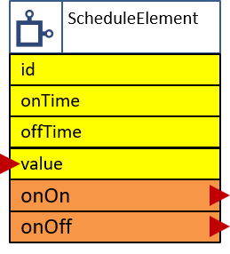

# The ScheduleElement

<div class="excerpt">
  
  <p>The ScheduleElement creates actions based on the time of day.</p>
</div>



When using this element a real time retrieving element must be configured as well like the [NTPTime](NTPTime) or [DCFTime](DCFTime).

One Schedule Element can be used to create a timespan during a day that creates 2 possible events. The first one when the ``on``-time has passed and a secone one when the ``off``-time has passed.

When starting the device the following events are emitted:

* When starting before the defined time span the `off`-event will be emitted.
* When starting the device in the middle of this time span the `on`-event will be emitted.
* When starting after the defined time span the `off`-event will be emitted.

The `onvalue` event is always emitted together with the `on` and `off` event situations.


## Element Configuration

The following properties are available for configuration of the element:

| Property  | Description                                                          |
| --------- | -------------------------------------------------------------------- |
| `ontime`  | Specifies the start of the time span.                                |
| `offtime` | Specifies the end of the time span.                                  |
| `onon`    | Actions.<br/>These actions are emitted when the on time has passed.  |
| `onoff`   | Actions.<br/>These actions are emitted when the off time has passed. |
| `onvalue` | Actions.<br/>These actions are emitted when the value is changing.   |

## Element State

The following properties are available with the current values at runtime

| Property | Description                                  |
| -------- | -------------------------------------------- |
| `active` | Is set to true when the Element is active.   |
| `value`  | Current logical on/off level of the element. |

## Example Configuration

```JSON
"schedule": {
  "lights": {
    "ontime": "04:00:00",
    "offtime": "18:00:00",
    "onon": "device/main?log=now on.",
    "onoff": " device/main?log=now off."
  }
}
```

## Example State

```JSON
"button/start": {
  "active": "true",
  "value": ???
}
```

## See also

* [Time Elements](timeelements)
