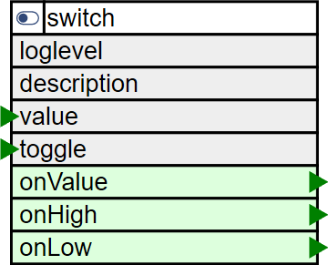

# Switch Element

<div class="excerpt">
  
  <p>The SwitchElement is used to toggle the state of a boolean value to on or off by a single Action.</p>
</div>

It is implemented as a special value element using the range 0 to 1 and can be used with the menu element.


## Web UI for the Switch Element

There is a dedicated card for this element available that will be used for the web server config and landing pages:


The Web UI for the Switch Element shows the actual state of the switch and the ouput value as a green/red signal.

## Element Configuration



In some cases it is required to use a momentary input to change the state of a boolean value from on to off and reverse.

It is also possible to use multiple momentary input elements even from external devices located at different places for the same switch.


## Inbound Actions

The actions received by the switch element can set the value to a specific logical level or toggle the existing level.

**switch/{id}/toggle=1** this inbound action will toggle the logical level of the switch from High to Low and reverse.

**switch/{id}/value={n}** this inbound action will set the logical level of the switch to the given value.
The passed value of `0` will set the value of the switch to `0`.
All other passed values will set the value of the switch to `1`.


## Outbound Actions

The actions emitted by the switch element are following the common naming conventions also found in other elements.

**onHigh** these actions are send when a logical level from a digital input a timer or a switch is changing to a HIGH value. The value given in the actions is `1`.

**onLow** these actions are send when a logical level from a digital input a timer or a switch is changing to a LOW value. The value given in the actions is `0`.

**onValue** these actions are send when a logical level from a digital input a timer or a switch is changing its value. The value given in the actions is `0` or `1`.


## State

The following properties are available with the current values at runtime

| Property | Description                                |
| -------- | ------------------------------------------ |
| `active` | Is set to true when the Element is active. |
| `value`  | Current logical value of the button input. |


## Examples

The Digital In Element gets the level of an GPIO pin and when released sends an action to the switch element to toggle the value.

The switch has the current value modified and send a action to the digital output element driving the onboard LED at D4


```JSON
"digitalin": {
  "in": {
    "description": "Input momentary button",
    "pin": "D3",
    "inverse": 1,
    "pullup": 1,
    "onLow": "switch/light?toggle=1"
  }
},

"switch": {
  "light": {
    "description": "Control light level",
    "value": 0,
    "onValue": "digitalout/led?value=$v"
  }
},

"digitalout": {
  "led": {
    "pin": "D0",
    "inverse": "true",
    "description": "Builtin LED is on Port D0 = GPIO16"
  },
}
```

To use a momentary button at another device the digital input there can use a remote device to send actions to the same switch element.

```JSON
"digitalin": {
  "in": {
    "description": "Input momentary button",
    "pin": "D3",
    "inverse": 1,
    "pullup": 1,
    "onLow": "remote/light?toggle=1"
  }
},

"remote": {
  "light": {
    "description": "Light at kitchen device",
    "host": "kitchending",
    "remoteid": "switch/light"
  }
},
```