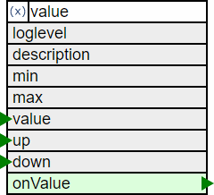

# The Value Element

<div class="excerpt">
  
  <p>The ValueElement combines receiving modifying actions for an internal state value and sending actions on changing the value.</p>
  <p>This can e.g. be used to drive a LED or a relay.</p>
</div>




It is used to implement a property or parameter independent from a specific Element that can send actions to multiple dependent elements.
The Values defined using a ValueElement can be modified by other Elements using several actions even through elements in a web UI.

### Example

Two Buttons should be used to increment and decrement the brightness of an attached LED.

### Solution

* Two ButtonElements are created to capture this input from digital input lines.
* Each button will trigger an up / down action for a ValueElement.
* The ValueElement defines the default value and valid range for the value.
* When the value changes the new value is sent to the PWMOutElement.

Here the ValueElement can help. It allows

* Setting a default value used at startup
* Get an up action to increment the value
* Get a down action to decrement the value
* Get a set action to set the value (e.g. to 0)
* Can limit the value to a lower and upper limit
* Send out an action when the value changes.

## Element Configuration

The following properties are available for configuration of the element:

**min** Defines the minimum of the value.                                  

**max** Defines the maximum of the value.                                  

**step** The value will be incrementd / decremented by the multiple of the step value
when using the up / down actions.

**value** An initial/default value can be set using the configuration.       

**onValue** These actions will be emitted whenever the value has changed.

**up** the value can be incremented by the passed value. Negative values are allowed.

**down** the value can be decremented by the passed value.

**label** The label is used together with the menu element to show the current selected value.

## Examples for actions

The value element accepts actions like

* `value/led?up=1` to increment by 1
* `value/led?up=10` to increment by maximal 10
* `value/led?down=1` to decrement by 1
* `value/led?up=-1` to decrement by 1

## Element State

The current value is reported as the state of a value element.

```JSON
{
  "value/volume": { "active": "true", "value": "4" }
}
```

## Example Configuration

```JSON
{
  "value": {
    "volume": {
      "min": 0,
      "max": 15,
      "value": 3,
      "onchange": "radio/r?volume=$v"
    }
  }
}
```

## See also

* Rotary Encoder
* Menu Element
* LED Recipe