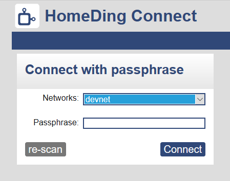

# wifimanager

The WiFi-Manager is a module of the device that is offering the functionality to register a device in the local network. It is implemented in the board class.

It can be reached using the URL: <http://{name}/setup.htm>

## First time setup

When a device is started the first time without having had a network connection before or after a reset the WiFi-Manager creates its own WiFi network to enable configuration from another device.

This WiFi network has the SSID `HomeDing` without a password. After the configuration this network will be shut down and cannot be used any more to connect to the device.

After connecting to this network the browser should be opened automatically and showing the configuration web page.

If the automatic start of the configuration UI is not working the UI can be started using the URL <http://192.168.4.1/setup.htm>

List available networks.

Enter WiFi password

Connect.

Confirm message?

## Setup again

The configuration UI is also available when the device is running in normal mode
using the url <http://{name}/setup.htm>

The other option implemented is to power up the device and then press the flash button while the led is blinking for 10 seconds.

(Do not press the button while pressing the reset button or powering up the device because this would start the program upload mode.)

The GPIO port used for the system led and the GPIO port used for the button to enter the configuration mode can be modified by specifying the properties of the [device element](/elements/device).

## Reset the network configuration

The network configuration includes the network name and the network password. This is not configured in a configuration file but stored in a special non volatile memory together with some network parameters that allows fast rejoining the existing network that was connected successfully before.

The device can be reset and forgets the network configuration when calling the url <http://{name}/$reset>.

## See also

* [Device Element](device.md)