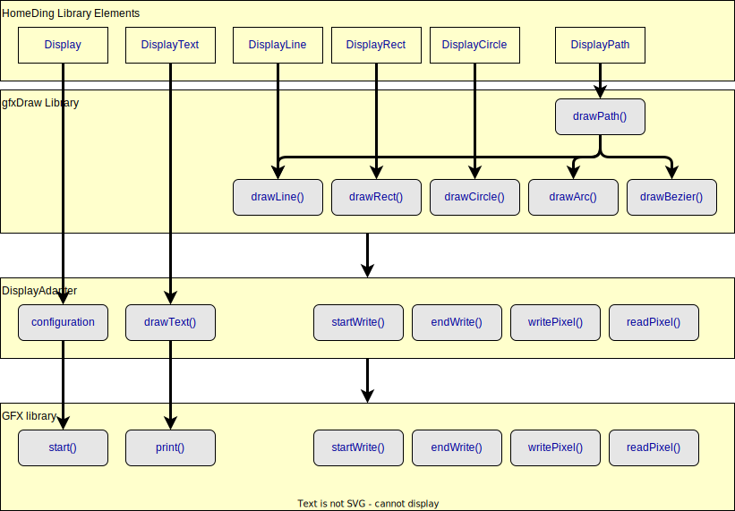

Many Elements that can be used on displays are bundled in this example sketch and folder.
The Sketch provides a meaningful set of core Elements that are extended by Elements in the src subfolder of the example.

Configurations for display enabled devices can be found in

## Display Boards and Display Example

The display elements that use the gfxDraw Library can be found inside the Display Example.

The Display example shows how to implement devices that take advantage of the
touch screens and has some additional elements implemented especially for this scenario.

As the final sketch file will exceed the memory available in ESP8266 and ESP32C3 processors they
should be avoided. The size of the sketch can be reduced by disabling elements that are not used
for a specific board.

# Graphical Displays

## Display Boards and Display Example

The display elements that use the gfxDraw Library can be found inside the Display Example.

The Display example shows how to implement devices that take advantage of the
touch screens and has some additional elements implemented especially for this scenario.

As the final sketch file will exceed the memory available in ESP8266 and ESP32C3 processors they
should be avoided. The size of the sketch can be reduced by disabling elements that are not used
for a specific board.

???

The HomeDing Library facilitates the connection of displays, enabling the realization of numerous use cases where
information must be displayed or visualized.  When combined with touch inputs or other input elements, it allows the
development of solutions that enable both local interactions and access to the browser interface.

Especially some ESP32 boards are available that combine display, touch screen and processor for implementing panels.

## Display Software Stack

In the following picture you can see the layers of the software stack used to implement the display functionality of the
HomeDing library.

### HomeDing Elements

The configuration of what should be shown on the display and the parameters of the display itself is.  Provided by the
element mechanism of the holding library, you can.  Find Elements for Different graphic displays, boards and chips and
most of them are independent from the underlying display in use.  These elements can be used on pixel oriented displays
in contrast to the displays that can display text only.

All of them support full color depth even if the display is not providing full colors.  A color of a pixel is
represented in the HomeDing library by a full 32 bit value using Alpha, Red, Green and Blue.

### Drawing functions

The drawing functionality of graphical elements is implemented by using the
[gfxDraw Arduino library](https://github.com/mathertel/gfxDraw).

This library is chosen because it provides more than just simple drawings like lines and circles and was made for
drawing dynamic value driven widgets on a pixel display.

The gfxDraw library especially supports drawing paths as known from the SVG drawing standard complex. This enables drawing even complex areas that can be defined by code, scaled, rotated and colored and can be adjusted in their dimensions to values.

This library Has a very flexible interface towards using a specific GFX library or another library for drawing on displays.

### Display Adapter

The Display Adapter classes implement the configuration for specific display types or display chips.
The Display Adapter classes are created by the corresponding display elements. By including a single display element only the specific Display Adapter for that display type will be linked into the final binary to save programming space.

They typically configure the bus used. For the data transfer. And use. One of the GFX. Libraries. To implement the driver specific protocols.

works on top of the GFX interface And requires at minimum the functionality to set a pixel to a specific color.

### GFX

The HomeDing library uses the [GFX library for Arduino](https://github.com/moononournation/Arduino_GFX) that can work
with many different displays like OLED or LCDs that can be connected via different busses like I2C, SPI or 16-bit.

Other libraries can be used too as the only functionality required is setting pixels to the output color.

### System and Core Elements

The full set of the core Elements are included in the firmware created by the Display Example
and can be activated by configuration.

* [NTPTIME](/elements/ntptime.md)
* [Time](/elements/time.md)
* [Value](/elements/value.md)
* [Button](/elements/button.md)
* [Switch](/elements/switch.md)
* [Analog](/elements/analog.md)
* [DigitalIn](/elements/digitalin.md)
* [DigitalSignal](/elements/digitalsignal.md)
* [DigitalOut](/elements/digitalout.md)
* [PWMOut](/elements/pwmout.md)
* [AND](/elements/and.md)
* [OR](/elements/or.md)
* [ADD](/elements/add.md)
* [SCENE](/elements/scene.md)
* [SELECT](/elements/select.md)
* [REFERENCE](/elements/reference.md)
* [Timer](/elements/timer.md)
* [Schedule](/elements/schedule.md)
* [Alarm](/elements/alarm.md)
* [MAP](/elements/map.md)
* [LOG](/elements/log.md)
* [REMOTE](/elements/remote.md)

### Display and Touch Elements

* [Touch](/elements/display/touch.md)

* DISPLAYGC9A01
* DISPLAYST7796
* DISPLAYESP32PANEL
* DISPLAYST7789

// #define HOMEDING_INCLUDE_DISPLAYTOUCHGT911

# define HOMEDING_INCLUDE_DISPLAYTOUCHFT6336

// #define HOMEDING_INCLUDE_DISPLAYTOUCHCST816

// Enable Elements for LIGHT control

# define HOMEDING_INCLUDE_COLOR

# define HOMEDING_INCLUDE_LIGHT

# define HOMEDING_INCLUDE_NEOPIXEL

# define HOMEDING_INCLUDE_APA102

# define HOMEDING_INCLUDE_MY9291

// Network Services

# define HOMEDING_INCLUDE_MQTT

# define HOMEDING_INCLUDE_WEATHERFEED

# define HOMEDING_INCLUDE_SDMMC

# define HOMEDING_INCLUDE_SD

### Sensors

Panels may be used to control the room temperature so some sensors from the HmeDing library
included in the firmware created by the Display Example and can be activated by configuration.

* DHT
* AM2320
* SHT20
* AHT20
* DALLAS

## Display Output Elements

### Analog Clock

The Analog Clock Element implementation can be found in the src sub-folder of the sketch. When
configured it will draw an analog clock at the specified location on the screen in the specified colors.

For more information on the supported configuration properties see
[AnalogClock Element].

###
