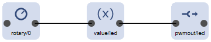

# LED Recipe

This recipe uses 2 digital input signals to change the brightness level of a LED.

This is can be accieved by using 2 [digital inputs](/elements/digitalin), a [value](/elements/value) and a [pwm](/elements/pwmout) element connected by some actions.


The 2 [digital input elements](/elements/digitalin) either increment or decrement like volume up and down buttons.
Each of them send an action for increment or decrement to the value element.

The increment button must be connected to `D5` and groud. The decrement button mst be connected to `D6`and ground. Both inputs are configured to use the internal pull up resistors to create a physical HIGH level when the buttons are not pressen. By pressing the buttons the physical level ist pulled to ground.

Because this is logically seen as 0 (not pressed) and 1 (pressed) the inverse mode is used.

The actions are emitted every time the button is pressed (going from 0 to 1).

The [value element](/elements/value) specifies the valid range of of 0...255 and gets controlled by the actions from the input element to increment or decrement the value. When the maximum level is reached no further increment will be done.

Every time the value of the value element is changed an action with the new value is passed to the pwmout element driving the LED.

The [pwmout element](/elements/pwmout) is configured to allow values within the same range as passed from the value element corresponding to 0 up to the maxium of the pwm output level at the `D4` GPIO.

## Configuration

```JSON
{
  "digitalin": {
    "up": {
      "loglevel": 2,
      "pin": "D5",
      "inverse": "true",
      "pullup": "true",
      "onlow": "value/led?up=10"
    },
    "down": {
      "loglevel": 2,
      "pin": "D5",
      "inverse": "true",
      "pullup": "true",
      "onlow": "value/led?down=10"
    }
  },

  "value": {
    "led": {
      "loglevel": 2,
      "value": 20,
      "min": 0,
      "max": 255,
      "onValue": "pwmout/led?value=$v",
      "description": "value for the LED"
    }
  },

  "pwmout": {
    "led": {
      "pin": "D4",
      "range": 255,
      "value": 10,
      "invers": "true",
      "description": "Build-in LED"
    }
  }
}
```

## Variation using a Rotary Element

Instead of using 2 buttons it is possible to connect a 
[rotary encoder](/elements/rotary) and modify the value and dim level of the LED by turning a knob.



The `rotary` element takes the input value from the encoder connected to `D5` and `D6` and generates actions with values of +10 or -10, sometimes a multiple of them and sends them to the value.

The `value` and the `pwmout` element keep doing the same as before.

```JSON
{
  "rotary": {
    "0": {
      "description": "Rotary Input",
      "pin1": "D5",
      "pin2": "D6",
      "step": 10,
      "onValue": "value/led?up=$v"
    }
  },

  "value": {
    "led": {
      "loglevel": 2,
      "value": 20,
      "min": 0,
      "max": 255,
      "onValue": "pwmout/led?value=$v",
      "description": "value for the LED"
    }
  },

  "pwmout": {
    "led": {
      "pin": "D4",
      "range": 255,
      "value": 10,
      "invers": "true",
      "description": "Build-in LED"
    }
  }
}
```

## See also

* [digital input element](/elements/digitalin)
* [rotary encoder](/elements/rotary)
* [value element](/elements/value)
* [pwmout element](/elements/pwmout) 