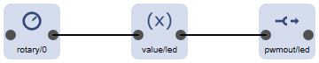

---
tags: led,rotary,recipe
...

# Dimming a LED using a Rotary Encoder

The following elements and hardware is used by this recipe:

* [Digital Input element](/elements/digitalin)
* [Rotary Encoder Element](/elements/rotary)
* [Value Element](/elements/value)
* [PWM Output Element](/elements/pwmout) 
* Built-in LED at port GPIO2(D4)

This recipe uses a [Rotary Encoder](/elements/rotary) to change the brightness level of a LED.



The [Rotary Encoder Element](/elements/rotary) takes the input value from the encoder connected to `D5` and `D6`. The common pin of the rotary encoder must be connected to ground (GND).
It generates actions with values of +10 or -10, sometimes a multiple of them and sends them to the value element.

The [Value Element](/elements/value) specifies the valid range of of 0...255 and gets controlled by the actions from the rotary encoder element to increment or decrement the value. When the maximum level is reached no further increment will be done.

Every time the value of the value element is changed an action with the new value is passed to the pwmout element driving the LED.

The [PWMout Element](/elements/pwmout) is configured to allow values within the same range as passed from the value element corresponding to 0 up to the maxium of the pwm output level at the `D4` GPIO.

On many boards there is a built-in LED attached to the GPIO2(D4).

## Configuration

```JSON
{
  "rotary": {
    "0": {
      "description": "Rotary Input",
      "pin1": "D5",
      "pin2": "D6",
      "step": 10,
      "onValue": "value/led?up=$v"
    }
  },

  "value": {
    "led": {
      "loglevel": 2,
      "value": 20,
      "min": 0,
      "max": 255,
      "onValue": "pwmout/led?value=$v",
      "description": "value for the LED"
    }
  },

  "pwmout": {
    "led": {
      "pin": "D4",
      "range": 255,
      "value": 10,
      "invers": "true",
      "description": "Build-in LED"
    }
  }
}
```

## See also

* [LED](/recipes/led)
