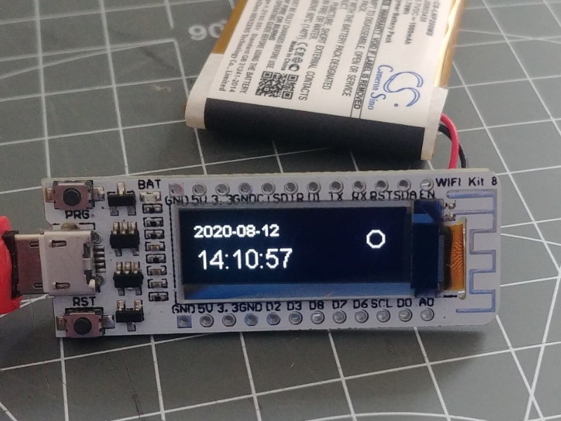

# NTP based clock

> draft ???

This recipe uses the ntptime element to get a current local time and displays current time and date on a display.

Panel ???


In `env.json` the system and hardware should be configured to get a local time and to initialise the display:

```JSON
{
  ...

  "ntptime": {
    "on": {
      "readtime": "2m",
      "zone": 2
    },
    
  "DisplaySSD1306": {
    "0": {
      "address": "60",
      "SDA": "D2",
      "SCL": "D1",
      "resetpin": "D0",
      "height": 32
    }
  }
}
```

In `config.json` the display items and the time related actions are configured:


```JSON
{
  "displaytext": {
    "date": {
      "type": "TEXT",
      "x": 0,
      "y": 0,
      "description": "show the date"
    },

    "time": {
      "type": "TEXT",
      "x": 0,
      "y": 16,
      "fontsize": 16,
      "description": "show the time"
    }
  },

  "time": {
    "0": {
      "ondate": "displaytext/date?show=$v",
      "ontime": "displaytext/time?show=$v"
    }
  },

}
```

The 2 display text elements are placed on the display and will show current time and date.
