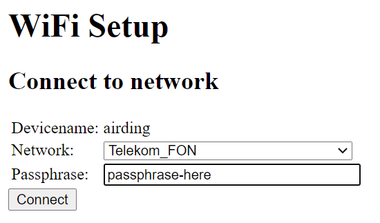

# Step by Step Bring your device to work

This is a step by step instruction to bring a device based on the HomeDing library to work.

 
- [Get a (brand new) EPS8266 board.](#get-a-brand-new-eps8266-board)
- [Upload the appropriate sketch](#upload-the-appropriate-sketch)
- [Register the device on the local WiFi network](#register-the-device-on-the-local-wifi-network)
- [Find the new device on the network](#find-the-new-device-on-the-network)
- [Upload the Web UI files to the onboard file system](#upload-the-web-ui-files-to-the-onboard-file-system)
- [Configure /env.json](#configure-envjson)
- [Configure /config.json](#configure-configjson)
- [Start with recipes and explore the available elements](#start-with-recipes-and-explore-the-available-elements)


## Get a (brand new) EPS8266 board.

The easiest board to start is any board that sticks to the nodemcu layout and features
and therefore can just be plugged into an USB board.

The following steps assume a board of this kind but different boards will not work very different.

See also [Boards supported by the HomeDing library](boards.md)


## Upload the appropriate sketch

For a nodemcu board having a ESP8266 chip and 4 MByte of Flash ROM the best sketch to start is the
[standard example](/examples/standard.md) that includes a lot of element types and board features.

You need to select the "NodeMCU 1.0 (ESP12-E Module)" board in the Arduino Board Manager
and use a memory layout that leaves 1 MByte for the SPIFFS file system by selecting
  "4M (1M SPIFFS)" in the "Flash Size" option.

You probably will have some benefits from the debug output on the Serial port at this point
    and therefore should activate "Serial" in the "Debug Port" option
    and "None" in the "Debug Level" option.

Select the right COM port and upload the sketch. It should only take about a minute
and the reboot the board.


## Register the device on the local WiFi network

There is a "hard way" to configure your local WiFi network name and passphrase into the source code in the file "secrets.h". If you like to follow this approach you can change the file and upload again.

Using the built-in WiFi Manager is the preferred method for connecting to a network and avoids hard-coding network credentials and re-programming your devices when your network changes .

Connect to the unsecured network called "HomeDing" by using any mobile device or computer with WiFi adapter.
Now you have a direct connectivity to this device and can start configuration. Some mobile devices or computer will
automatically open the network configuration page. If this is not working please open
http://192.168.4.1/ or http://192.168.4.1/$setup manually.



The current device name is shown in this dialog and you will find the device later on the registered network using http://\<devicename\>.

* Select your private WiFi Network and enter the passphrase.
* Press "Connect" to connect.

It may take some time and if everything is fine you will see the HomeDing network disappear and you can re-join your local network.


You may also look into the Serial output using the `Serial Monitor` of the Arduino Environment to see some messages about what is happening inside the device.

```TXT
SDK:2.2.2-dev(38a443e)/Core:2.6.3=20603000/lwIP:STABLE-2_1_2_RELEASE/glue:1.2-16-ge23a07e/BearSSL:89454af
00:00:02 sys:i Device starting...
...
00:00:04 sys:t connected.
00:00:04 sys:i airding 192.168.2.118
00:00:04 sys:t Connected to: DEVNET
...
```


## Find the new device on the network

As long as there is no configuration mode requested the device will register itself on the local network
using a temporary device name and then start into normal operating mode.

Without any configuration the devicename is constructed by "ESP-" and a device specific hex number given by the digits of the uniques network adapter MAC address.

try: 
* http://\<devicename from the WIFI Manager dialog\>
* http://\<devicename from the Serial Monitor\> (should be identical)
* http://\<ip-address from the Serial Monitor\>


## Upload the Web UI files to the onboard file system

> Draft ???

GET <http://homeding/$upload> <sup>*1</sup>

GET <http://homeding/$boot> <sup>*1</sup>

Upload data folder


## Configure /env.json

> Draft ???

```JSON
{
  "device": {
    "0": {
      "name": "newdevice"
    }
  }
}
```

## Configure /config.json

> Draft ???

* blink sample

## Start with recipes and explore the available elements


* [Recipes](recipes.md)
* [Elements](elements.md)