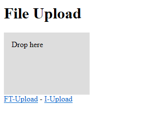
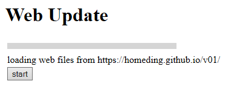

# Step by Step uploading the files for the web UI

This is a step by step instruction to bring a device based on the HomeDing library to work.

To upload the firmware & sketch see [Step by Step Bring your device to work](stepsnewdevice.md)

- [Drag & Drop uploading](#drag--drop-uploading)
- [Uploading using the SPIFFS filesystem uploader](#uploading-using-the-spiffs-filesystem-uploader)
- [Upload the Web UI files to the onboard file system](#upload-the-web-ui-files-to-the-onboard-file-system)
- [Configure /env.json](#configure-envjson)
- [Configure /config.json](#configure-configjson)
- [Start with recipes and explore the available elements](#start-with-recipes-and-explore-the-available-elements)


## Drag & Drop uploading 

Open <http://homeding/$upload> <sup>*1</sup> to use the drag & drop upload utility:



The HomeDing device has an embedded web server that offers a simple upload functionality that is built-in the sketch.

You can reach it on a un-configured device using the url http://ESP_xxxxxx/$upload.
The real server name or the ip-address of an un-configured device can be found in the serial output.

<!-- ### TODO: ???
* [ ] add configuration of device name. -->

http://ESP_2987B5/$upload
http://192.168.2.170/$upload ??? IP address ?

The files that need to be uploaded to implement the Web UI can be found in the FullDing example in the data folder. 

There are 3 uploads required:

* **The files in the root folder**. These are the files that are directly contained in the data folder.
You can select them all (but not the sub folders) and drop them on the drop region of the page.

* **The files for filetypes**. These files can be found in the `ft` folder.
You need to navigate to <http://homeding/$upload#ft> and drop all the files in the folder.

* **The files for elements**. These files can be found in the `i` folder.
You need to navigate to <http://homeding/$upload#i> and drop all the files in the folder.


## Uploading using the SPIFFS filesystem uploader 

If you have the ESP8266 Uploda tool installed you can also use this approach to upload the initial files. 

As this method will always upload all files at once you probably will overwrite the configuration so another method needs to be used when uploading to a configured device.

To verify that the uploaded file are present you can request the list of existing files using
<http://192.168.2.170/$list>

See: <https://github.com/esp8266/arduino-esp8266fs-plugin>


## Upload the Web UI files to the onboard file system

Open <http://homeding/$boot> <sup>*1</sup> to use this upload utility:



This is a builtin upload and update tool for the web files from the documentation web site.
The files are contained in the directory <https://homeding.github.io/v01> and a list of the files can be found <https://homeding.github.io/v01/list.txt>

From this file all files are fetched and uploaded to the device one-by-one when pressing the start button.

There may be multiple versions at the same time.

This method doesn't overwrite the config files on the device so it can be used on configured devices without wiping the configuration.


## Configure /env.json

> Draft ???

```JSON
{
  "device": {
    "0": {
      "name": "newdevice"
    }
  }
}
```

## Configure /config.json

> Draft ???

* blink sample

## Start with recipes and explore the available elements


* [Recipes](recipes.md)
* [Elements](elements.md)

---

**1**: replace `homeding` with the network name of your device to use this link.
