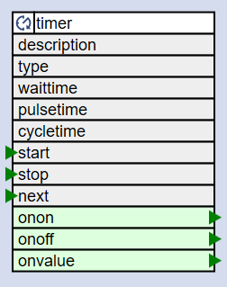

# Timer Element

The TimerElement creates events based on a one-time or cyclic timing pattern.



When started after the specified wait time a pulse start is emitted and after the pulse time a pulse end event is emitted.
The cycle time and the type LOOP can be specified to restart the timer automatically.

```
        events: +--> "on"         +--> "off"
                +--> "value=1"    +--> "value=0"
                |                 |
________________/‾‾‾‾‾‾‾‾‾‾‾‾‾‾‾‾‾\______________

<-- waittime --> <-- pulsetime -->
<------------- cycletime ----------------------->
<- _state=0  --> <- _state=1 ----> <- _state=2 -> <- _state=3 (no LOOP) ...
```

Properties

The following properties are available for config, actions and state of a timer element:

| Properties   | Type   | Description                                              |
| ------------ | ------ | -------------------------------------------------------- |
| type         | Config | When set to “LOOP” the timer restarts after the cycle. |
| waittime     | Config | time before "on" action                                  |
| pulsetime\*1 | Config | time between "on" and "off" action.                      |
| cycletime\*2 | Config | time of a complete timer cycle.                          |
| onon         | Config | Actions dispatched when the pulse time starts.           |
| onoff        | Config | Actions dispatched when the pulse time ends.             |
| onvalue      | Config | Actions dispatched when the pulse time starts or ends    |
| start        | Action | Start the timer                                          |
| stop         | Action | Stop the timer                                           |
| active       | State  | Is set to true when the Element is active.               |
| state        | State  | Current state. See diagram above                         |
| Time         | State  | Current time (in seconds) in the current cycle.          |
| Level        | State  | Current level of the timer. See diagram above.           |

\*1 required property
\*2 When cycletime is not not specified or too low the cycletime gets adjusted to waittime+pulsetime.

### Example for Configuration

```JSON
"timer": {
  "relais": {
    "type": "LOOP",
    "waittime": "10s",
    "pulsetime": "5s",
    "onon": "digitalout/led?on",
    "onoff": "digitalout/led?off"
  }
}
```

### Example for State

```JSON
"timer/relais": {
  "active": "true",
  "state": "0",
  "time": "8",
  "level": "0"
}
```

