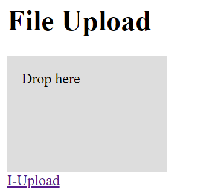

# Web Services ???

When retrieving HTML from the server just return the content of the files in the filesystem and doesn't execute any functionality related to elements or actions.

The web services support getting access to the inner values and state of the system and elements of the device based on the HomeDing library.

All services provide a REST base interface and start using a `$` character.

### /$sysinfo

This service returns information from the system level like the flash memory available to the file system.

Example with comments

```JSON
{
  "devicename": "displayding",  // network name of the device
  "build": "Jan  2 2019",       // build-date of the uploaded sketch
  "free heap": "29224",         // actual free memory on the heap.
  "flash-size": "4194304",      // flash memory sized specified at compile time
  "flash-real-size": "4194304", // size of the available flash memory of the board
  "fs-totalBytes": "957314",    // size of the SPIFFs file system
  "fs-usedBytes": "224645",     // used size of the SPIFFs file system
  "ssid": "devnet"              // actual connected network by SSID
}
```

This information is read only.

### /$reboot

This service reboots the device.

### /$reset <span style="color:red">\*</span>

This service wipes out the network configuration and then restarts the device.

### /$elements

This REST service returns an array with all elements that are implemented in the firmware of the device.

Example:
```JSON
[ "ssdp", "ota", "device", "time", "remote", "ntptime",
  "dstime", "serialcmd", "my", "value", "button", "analog",
  "timer", "schedule", "digitalout", "pwmout", "displaytext",
  "displaydot", "displayLCD" ,"displaySSD1306", "displaySH1106",
  "dht", "rfsend", "rotary", "alarm"
]
```

### /$upload <span style="color:red">\*</span>

This URL returns a minimal HTML page that can be used to upload files to the server using drag & drop.



### /$scan <span style="color:red">\*</span>

This service is required for the network configuration page (/setup.htm) and returns an array with all available networks.

This service has to be called multiple times. The first time starts scanning and results will be available some seconds later.

```JSON
[
  {"id":"VVBLHH0909 2", "rssi":"-83", "open":"0"},
  {"id":"devnet", "rssi":"-67", "open":"0"},
  {"id":"DIRECT-D9-HP OfficeJet 4650", "rssi":"-75" ,"open":"0"}
]
```

### /$connect=...&p=...** &wps=... <span style="color:red">\*</span>

This service is required for the network configuration page (/setup.htm) and allows changing the network configuration.

### /$list

This service is required for the IDE page implementation (/ding-ide.htm) and returns a list of all files on the filesystem.

### /$board

This service returns the state of all existing elements running in the device.

```JSON
{
  "device/0":  {"active":"true", "name":"DHTdevice", "description":"IoT Dev-Device with a DHT Sensor", "nextboot":"90"},
  "ota/0": {"active":"true"},
  "ssdp/0": {"active":"true"},
  "remote/display-t": {"active":"true"},
  "remote/display-h": {"active":"true"},
  "dht/on": {"active":"true", "temperature":"21.60", "humidity":"46.00"}}
```

### /$boardht/on**

This service returns the state of the element addressed by the more specific url.

```JSON
{
  "dht/on": {
    "active":"true",
    "temperature":"21.60",
    "humidity":"46.00"
  }
}
```

### /$boardisplaytext/t?value=21.60**

This service sends an action to the element specified by the URL to set the value.

This is how the remote element will send actions across the network to other devices.

> \* this service is not available when the device runs in the save mode. See [Save Mode](savemode) for details.
